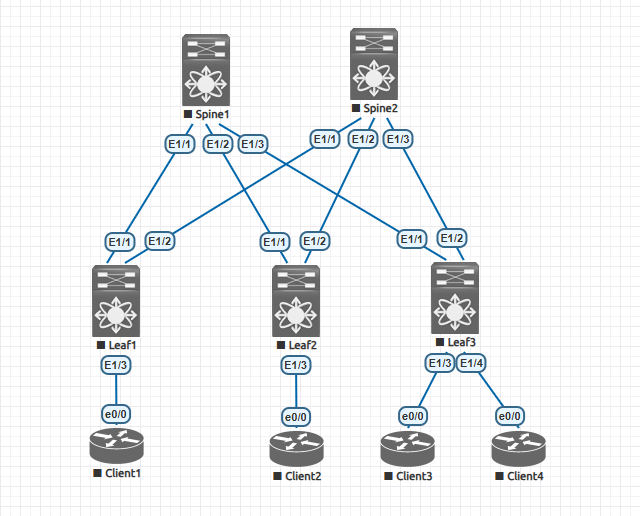

                                             Домашнее задание
                        Проектирование адресного пространства

*Цель:*

1. Собрать схему CLOS
2. Распределить адресное пространство.

Схема сети CLOS.

Таблица адресного пространства.

  Общая таблица сетей.

|      Spine1           |     Spine2            |         Leaf1         |       Leaf2           |     Leaf3             |
|-----------------------|-----------------------|-----------------------|-----------------------|-----------------------|
| Eth1/1 10.10.1.252/24 | Eth1/1 10.10.2.252/24 | Eth1/1 10.10.1.1/24   | Eth1/1 10.10.1.2/24   | Eth1/1 10.10.1.3/24   |
| Eth1/2 10.10.1.253/24 | Eth1/2 10.10.2.253/24 | Eth1/2 10.10.2.1/24   | Eth1/2 10.10.2.2/24   | Eth1/2 10.10.2.3/24   |
| Eth1/3 10.10.1.254/24 | Eth1/3 10.10.2.254/24 | Eth1/3 10.10.5.254/24 | Eth1/3 10.10.6.254/24 | Eth1/3 10.10.7.253/24 |
|                       |                       |                       |                       | Eth1/4 10.10.8.254/24 |  
|                       |                       |                       |                       |                       |
|                       |         Client1       |         Client2       |       Client3         |     Client4           |
|                       | Gi0/1 10.10.5.1/24    | Gi0/1 10.10.6.1/24    | Gi0/1 10.10.7.1/24    |  Gi0/1 10.10.8.1/24   |
