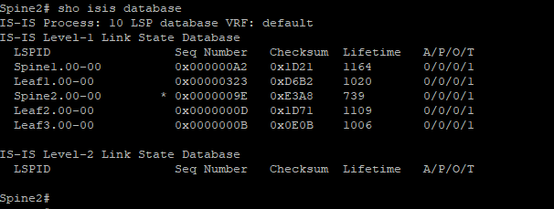

Курс "Дизайн сетей ЦОД" - OTUS.ru

                                             Домашнее задание
*Цель:*                     Настроить IS-IS для Underlay сети

1. Настроить ISIS в Underlay сети, для IP связанности между всеми сетевыми устройствами.
2. Зафиксировать в документации - план работы, адресное пространство, схему сети, конфигурацию устройств
3. Убедиться в наличии IP связанности между устройствами в ISIS домене

**1. Адресное пространство.** 

|      Spine1           |     Spine2            |         Leaf1         |       Leaf2           |     Leaf3             |
|-----------------------|-----------------------|-----------------------|-----------------------|-----------------------|
| Eth1/1 10.10.1.1/30   | Eth1/1 10.10.2.1/30   | Eth1/1 10.10.1.2/30   | Eth1/1 10.10.1.6/30   | Eth1/1 10.10.1.9/30   |
| Eth1/2 10.10.1.5/30   | Eth1/2 10.10.2.5/30   | Eth1/2 10.10.2.2/30   | Eth1/2 10.10.2.6/30   | Eth1/2 10.10.2.9/30   |
| Eth1/3 10.10.1.9/30   | Eth1/3 10.10.2.9/30   | Eth1/3 10.10.5.1/24   | Eth1/3 10.10.6.1/24   | Eth1/3 10.10.7.1/24   |
|                       |                       |                       |                       | Eth1/4 10.10.8.1/24   |  
|                       |                       |                       |                       |                       |
|                       |                       |                       |                       |                       |
|                       |         Client1       |         Client2       |       Client3         |     Client4           |
|                       | e0/0 10.10.5.10/24    |  e0/0 10.10.6.10/24   | e0/0 10.10.7.10/24    |  e0/0 10.10.8.10/24   |
|                       | GW 10.10.5.1          | GW 10.10.6.1          | GW 10.10.7.1          | GW 10.10.8.1          | 

**2. Схема сети.**

**3. Конфигурация оборудования.**

Spine_1 - [Здесь](Configs/Spine1.txt)

Spine_2 - [Здесь](Configs/Spine2.txt)

Leaf_3 -  [Здесь](Configs/Leaf3.txt)

**4. Проверка связанности между сегментами сети.** 

   *a. Проверяем доступность пакетами ICMP c Сlient_1 [10.10.5.10] до Client_2 [10.10.6.10], Client_3 [10.10.7.10], Client_4 [10.10.8.10]*

 
   *b. Проверяем соседство ISIS*

**Spine_1** 
Show ISIS Database 
 

Show ISIS adjacency

**Spine_2**
Show ISIS Database  
 

Show ISIS adjacency

   *c. Проверяем маршруты.*

Spine_1  
 

Spine_2  
 

К сожалению на виртуализации не отработал протокол BFD и не вышло настроить аутентификацию ISIS, соседсво при включении этих параметров разваливалось, диагностировать и устранить проблему не получилось.  

    