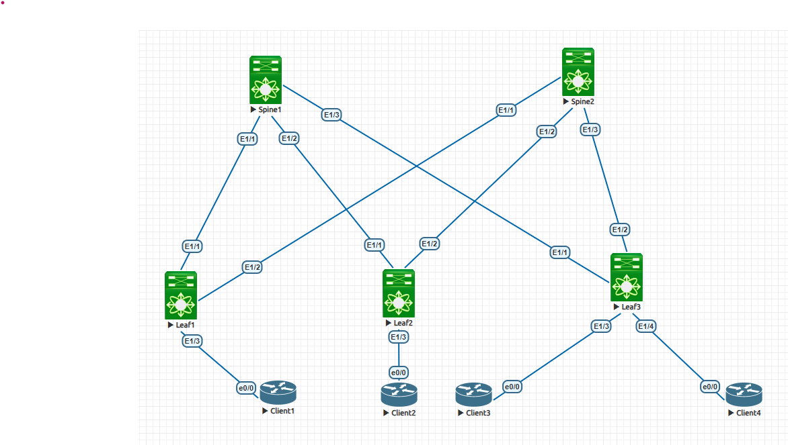
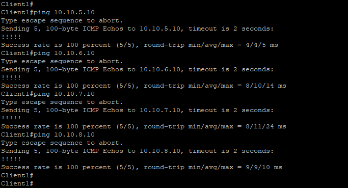
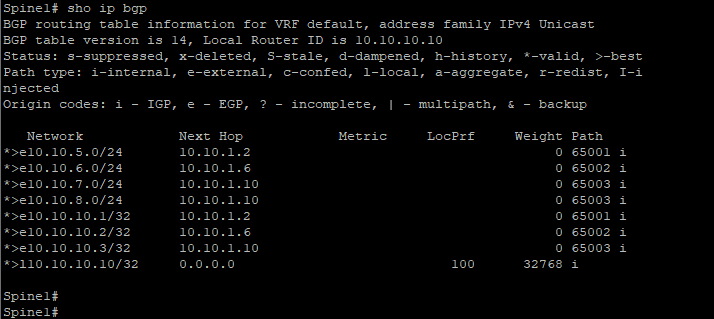
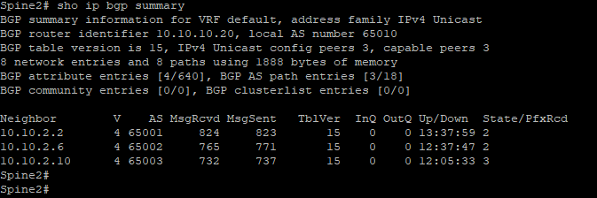
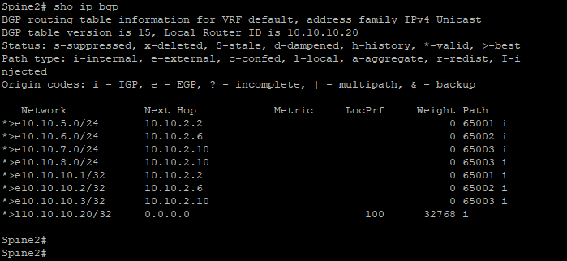
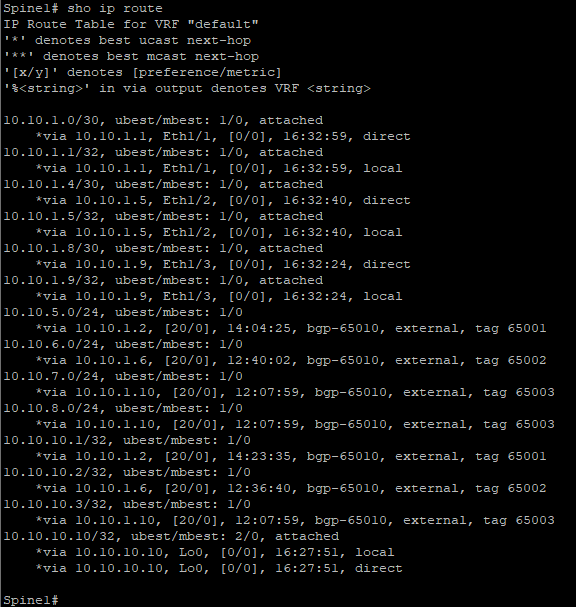
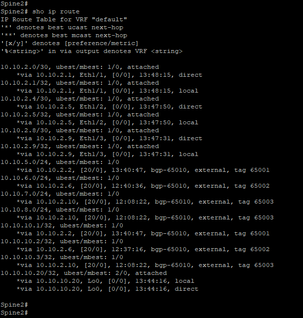
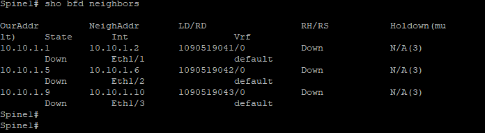
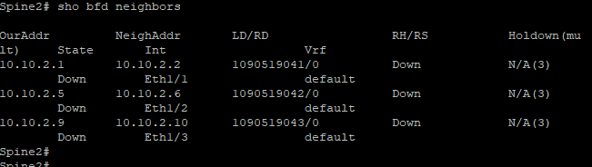

Курс "Дизайн сетей ЦОД" - OTUS.ru

                                             Домашнее задание
*Цель:*                     Настроить eBGP для Underlay сети

1. Настроить eBGP в Underlay сети, для IP связанности между всеми сетевыми устройствами.
2. Зафиксировать в документации - план работы, адресное пространство, схему сети, конфигурацию устройств.
3. Убедиться в наличии IP связанности между устройствами в BGP домене.

**1. Схема сети.**

**2. Адресное пространство.** 

|      Spine1           |     Spine2            |         Leaf1         |       Leaf2           |     Leaf3             |
|-----------------------|-----------------------|-----------------------|-----------------------|-----------------------|
| Eth1/1 10.10.1.1/30   | Eth1/1 10.10.2.1/30   | Eth1/1 10.10.1.2/30   | Eth1/1 10.10.1.6/30   | Eth1/1 10.10.1.9/30   |
| Eth1/2 10.10.1.5/30   | Eth1/2 10.10.2.5/30   | Eth1/2 10.10.2.2/30   | Eth1/2 10.10.2.6/30   | Eth1/2 10.10.2.9/30   |
| Eth1/3 10.10.1.9/30   | Eth1/3 10.10.2.9/30   | Eth1/3 10.10.5.1/24   | Eth1/3 10.10.6.1/24   | Eth1/3 10.10.7.1/24   |
|                       |                       |                       |                       | Eth1/4 10.10.8.1/24   |  
| Lo0 10.10.10.10/32    | Lo0 10.10.10.20/32    | Lo0 10.10.10.1/32     | Lo0 10.10.10.2/32     | Lo0 10.10.10.3/32     |
|                       |                       |                       |                       |                       |
|                       |         Client1       |         Client2       |       Client3         |     Client4           |
|                       | e0/0 10.10.5.10/24    |  e0/0 10.10.6.10/24   | e0/0 10.10.7.10/24    |  e0/0 10.10.8.10/24   |
|                       | GW 10.10.5.1          | GW 10.10.6.1          | GW 10.10.7.1          | GW 10.10.8.1          | 

Автономные системы BGP (ASN)

|      Spine1           |     Spine2            |         Leaf1         |       Leaf2           |     Leaf3             |
|-----------------------|-----------------------|-----------------------|-----------------------|-----------------------|
| ASN 65010             | ASN 65010             | ASN 65001             | ASN 65002             | ASN 65003             |

**3. Конфигурация оборудования.**

Spine1 - [Здесь](Configs/Spine1.txt)

Spine2 - [Здесь](Configs/Spine2.txt)

Leaf1 -  [Здесь](Configs/Leaf1.txt)

Leaf2 -  [Здесь](Configs/Leaf2.txt)

Leaf3 -  [Здесь](Configs/Leaf3.txt)

**4. Проверка связанности между сегментами сети.** 

   *a. Проверяем доступность пакетами ICMP c Сlient_1 [10.10.5.10] до Client_2 [10.10.6.10], Client_3 [10.10.7.10], Client_4 [10.10.8.10]*

 
    *b. Проверяем соседство eBGP*
    
    **Spine_1**
    
    Show ip bgp summury                  

! 
    
    Show ip bgp              

    
    **Spine_2**
    
    Show ip bgp summury            
 
    
    Show ip bgp          

    
    
       *c. Проверяем маршруты.*
    
    Spine_1              
 
    
    Spine_2                  
 
    
    К сожалению, в очередной раз, не отработал протокол BFD, по всей видимости какието ограничения на виртуализации. 

    
        

