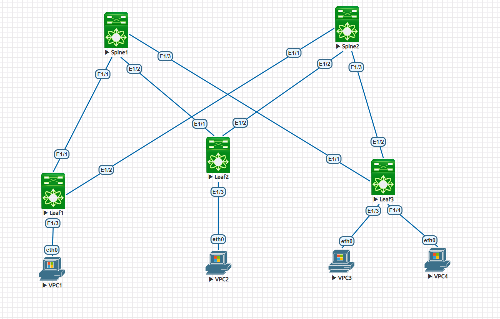
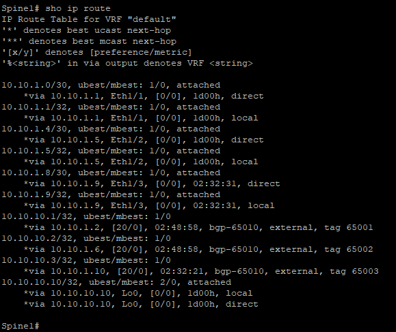
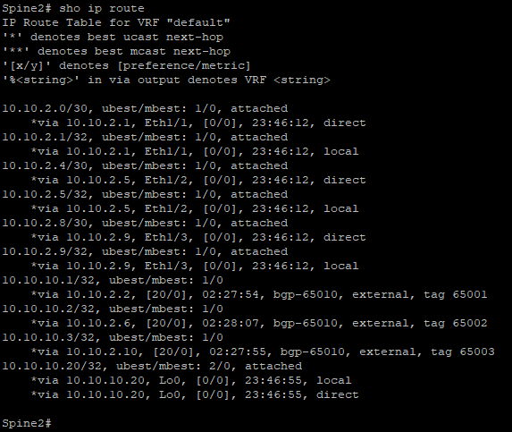
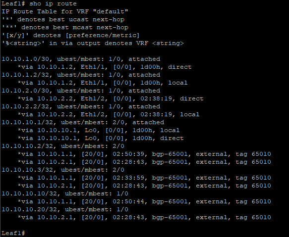
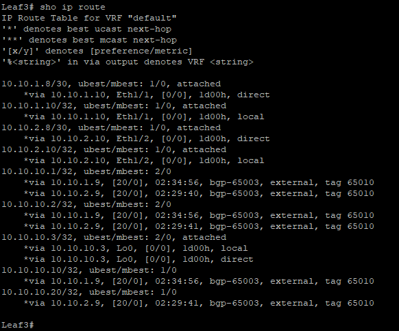

                                                              Курс "Дизайн сетей ЦОД" - OTUS.ru

                                             Домашнее задание
*Цель:*                     Настроить eBGP для Underlay сети

1. Настроить BGP peering между Leaf и Spine в AF l2vpn evpn.
2. Настроить связанность между клиентами в первой зоне и убедитесь в её наличии.
3. Зафиксировать в документации - план работы, адресное пространство, схему сети, конфигурацию устройств.

**1. Схема сети.**

**2. Адресное пространство.** 

|      Spine1           |     Spine2            |         Leaf1         |       Leaf2           |     Leaf3             |
|-----------------------|-----------------------|-----------------------|-----------------------|-----------------------|
| Eth1/1 10.10.1.1/30   | Eth1/1 10.10.2.1/30   | Eth1/1 10.10.1.2/30   | Eth1/1 10.10.1.6/30   | Eth1/1 10.10.1.9/30   |
| Eth1/2 10.10.1.5/30   | Eth1/2 10.10.2.5/30   | Eth1/2 10.10.2.2/30   | Eth1/2 10.10.2.6/30   | Eth1/2 10.10.2.9/30   |
| Eth1/3 10.10.1.9/30   | Eth1/3 10.10.2.9/30   | Eth1/3 access 11      | Eth1/3 access 11      | Eth1/3 access 11      |
|                       |                       |                       |                       | Eth1/4 access 11      |  
| Lo0 10.10.10.10/32    | Lo0 10.10.10.20/32    | Lo0 10.10.10.1/32     | Lo0 10.10.10.2/32     | Lo0 10.10.10.3/32     |
|                       |                       |                       |                       |                       |
|          VLAN         |         VPC1          |            VPC2       |          VPC3         |        VPC4           |
|           11          | e0/0 192.168.100.1/28 | e0/0 192.168.100.2/28 | e0/0 192.168.100.3/28 | e0/0 192.168.100.4/28 |
|                       |                       |                       |                       |                       | 

Автономные системы BGP (ASN)

|      Spine1           |     Spine2            |         Leaf1         |       Leaf2           |     Leaf3             |
|-----------------------|-----------------------|-----------------------|-----------------------|-----------------------|
| ASN 65010             | ASN 65010             | ASN 65001             | ASN 65002             | ASN 65003             |

**3. Конфигурация оборудования.**

Spine1 - [Здесь](Configs/Spine1.txt)

Spine2 - [Здесь](Configs/Spine2.txt)

Leaf1 -  [Здесь](Configs/Leaf1.txt)

Leaf2 -  [Здесь](Configs/Leaf2.txt)

Leaf3 -  [Здесь](Configs/Leaf3.txt)

**4. Проверка связанности между сегментами сети.** 

*a. Проверяем доступность пакетами ICMP c VPC1 [192.168.100.1] до VPC2 [192.168.100.2], VPC3 [192.168.100.3], VPC4 [192.168.100.4]*

VPC1> ping 192.168.100.2

            84 bytes from 192.168.100.2 icmp_seq=1 ttl=64 time=13.166 ms  
            84 bytes from 192.168.100.2 icmp_seq=2 ttl=64 time=11.654 ms  
            84 bytes from 192.168.100.2 icmp_seq=3 ttl=64 time=16.618 ms  
            84 bytes from 192.168.100.2 icmp_seq=4 ttl=64 time=11.418 ms  
            84 bytes from 192.168.100.2 icmp_seq=5 ttl=64 time=11.186 ms  

VPC1> ping 192.168.100.3

            84 bytes from 192.168.100.3 icmp_seq=1 ttl=64 time=13.070 ms  
            84 bytes from 192.168.100.3 icmp_seq=2 ttl=64 time=12.740 ms  
            84 bytes from 192.168.100.3 icmp_seq=3 ttl=64 time=14.562 ms  
            84 bytes from 192.168.100.3 icmp_seq=4 ttl=64 time=13.092 ms  
            84 bytes from 192.168.100.3 icmp_seq=5 ttl=64 time=15.021 ms  

VPC1> ping 192.168.100.4

            84 bytes from 192.168.100.4 icmp_seq=1 ttl=64 time=10.467 ms  
            84 bytes from 192.168.100.4 icmp_seq=2 ttl=64 time=14.554 ms  
            84 bytes from 192.168.100.4 icmp_seq=3 ttl=64 time=13.592 ms  
            84 bytes from 192.168.100.4 icmp_seq=4 ttl=64 time=11.502 ms  
            84 bytes from 192.168.100.4 icmp_seq=5 ttl=64 time=12.269 ms

   *b. Проверяем маршруты UNDERLAY.*
    
**Spine1**              
 
    
**Spine2**                  
 

**Leaf1** 
 

**Leaf3** 
 