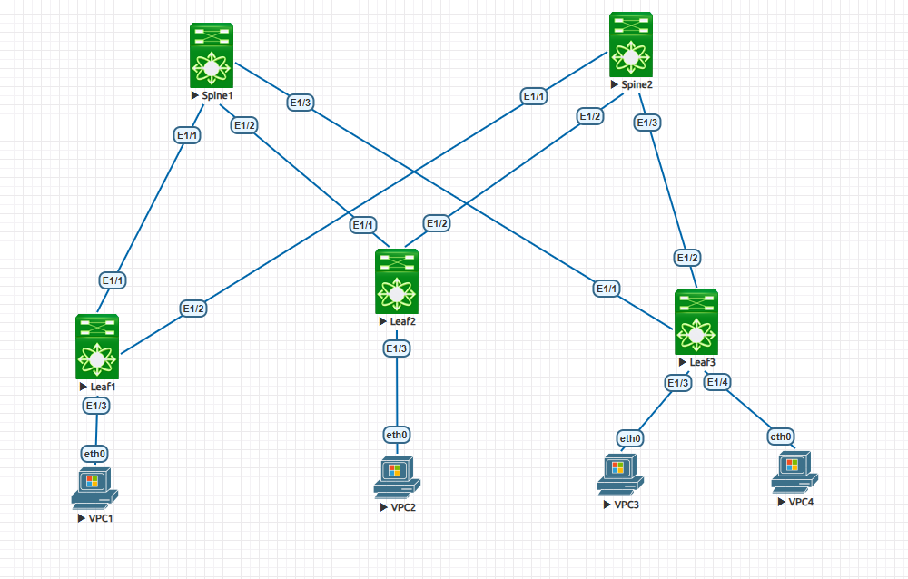

                                                              Курс "Дизайн сетей ЦОД" - OTUS.ru

                                                 Домашнее задание. 
*Цель:* **Настроить маршрутизацию в рамках Overlay между клиентами.**

1. Настроить каждого клиента в своем VNI.
2. Настроить маршрутизацию между клиентами.
3. Зафиксировать в документации - план работы, адресное пространство, схему сети, конфигурацию устройств

**1. Схема сети.**

**2. Адресное пространство.** 

|      Spine1           |     Spine2             |         Leaf1          |       Leaf2            |     Leaf3              |
|-----------------------|------------------------|------------------------|------------------------|------------------------|
| Eth1/1 10.10.1.1/30   | Eth1/1 10.10.2.1/30    | Eth1/1 10.10.1.2/30    | Eth1/1 10.10.1.6/30    | Eth1/1 10.10.1.9/30    |
| Eth1/2 10.10.1.5/30   | Eth1/2 10.10.2.5/30    | Eth1/2 10.10.2.2/30    | Eth1/2 10.10.2.6/30    | Eth1/2 10.10.2.9/30    |
| Eth1/3 10.10.1.9/30   | Eth1/3 10.10.2.9/30    | Eth1/3 access 11       | Eth1/3 access 12       | Eth1/3 access 11       |
|                       |                        |                        |                        | Eth1/4 access 13       |  
| Lo0 10.10.10.10/32    | Lo0 10.10.10.20/32     | Lo0 10.10.10.1/32      | Lo0 10.10.10.2/32      | Lo0 10.10.10.3/32      |

                                                     Адресация VPC             

|         VLAN          |      VPC1              |         VPC2           |          VPC3          |         VPC4           |
|-----------------------|------------------------|------------------------|------------------------|------------------------|
|   VLAN **11** (GW .1) | e0/0 192.168.111.10/28 |                        | e0/0 192.168.111.20/28 |                        |  
|   VLAN **12** (GW .1) |                        | e0/0 192.168.112.10/28 |                        |                        | 
|   VLAN **13** (GW .1) |                        |                        |                        | e0/0 192.168.113.10/28 | 

                                               Автономные системы BGP (ASN)

|      Spine1           |     Spine2            |         Leaf1         |       Leaf2           |     Leaf3             |
|-----------------------|-----------------------|-----------------------|-----------------------|-----------------------|
| ASN 65010             | ASN 65010             | ASN 65001             | ASN 65002             | ASN 65003             |
