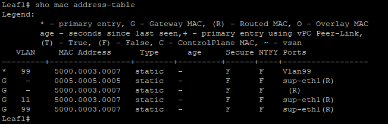
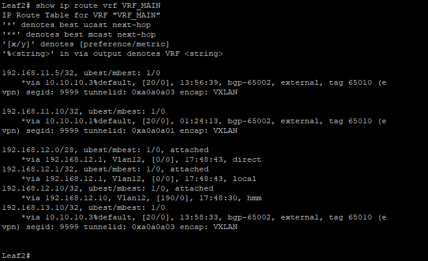

                                                              Курс "Дизайн сетей ЦОД" - OTUS.ru

                                                 Домашнее задание. 
*Цель:* **Настроить маршрутизацию в рамках Overlay между клиентами.**

1. Настроить каждого клиента в своем VNI.
2. Настроить маршрутизацию между клиентами.
3. Зафиксировать в документации - план работы, адресное пространство, схему сети, конфигурацию устройств

**1. Схема сети.**

**2. Адресное пространство.** 

|      Spine1           |     Spine2             |         Leaf1          |       Leaf2            |     Leaf3              |
|-----------------------|------------------------|------------------------|------------------------|------------------------|
| Eth1/1 10.10.1.1/30   | Eth1/1 10.10.2.1/30    | Eth1/1 10.10.1.2/30    | Eth1/1 10.10.1.6/30    | Eth1/1 10.10.1.9/30    |
| Eth1/2 10.10.1.5/30   | Eth1/2 10.10.2.5/30    | Eth1/2 10.10.2.2/30    | Eth1/2 10.10.2.6/30    | Eth1/2 10.10.2.9/30    |
| Eth1/3 10.10.1.9/30   | Eth1/3 10.10.2.9/30    | Eth1/3 access 11       | Eth1/3 access 12       | Eth1/3 access 11       |
|                       |                        |                        |                        | Eth1/4 access 13       |  
| Lo0 10.10.10.10/32    | Lo0 10.10.10.20/32     | Lo0 10.10.10.1/32      | Lo0 10.10.10.2/32      | Lo0 10.10.10.3/32      |

                                                     Адресация VPC             

|         VLAN          |      VPC1              |         VPC2           |          VPC3          |         VPC4           |
|-----------------------|------------------------|------------------------|------------------------|------------------------|
|   VLAN **11** (GW .1) | e0/0 192.168.111.10/28 |                        | e0/0 192.168.111.5/28 |                        |  
|   VLAN **12** (GW .1) |                        | e0/0 192.168.112.10/28 |                        |                        | 
|   VLAN **13** (GW .1) |                        |                        |                        | e0/0 192.168.113.10/28 | 

                                               Автономные системы BGP (ASN)

|      Spine1           |     Spine2            |         Leaf1         |       Leaf2           |     Leaf3             |
|-----------------------|-----------------------|-----------------------|-----------------------|-----------------------|
| ASN 65010             | ASN 65010             | ASN 65001             | ASN 65002             | ASN 65003             |

**3. Конфигурация оборудования (конфигурация SPINE не менялась).**

Spine1 - [Здесь](Configs/Spine1.txt)

Spine2 - [Здесь](Configs/Spine2.txt)

Leaf1 -  [Здесь](Configs/Leaf1.txt)

Leaf2 -  [Здесь](Configs/Leaf2.txt)

Leaf3 -  [Здесь](Configs/Leaf3.txt)

**4. Проверка связанности между сегментами сети.** 

*a. Проверяем доступность пакетами ICMP c VPC1 [192.168.11.10] до VPC2 [192.168.12.10], VPC3 [192.168.11.5], VPC4 [192.168.13.10]*

     VPC1> ping 192.168.11.5  
          84 bytes from 192.168.11.5 icmp_seq=1 ttl=64 time=12.067 ms
          84 bytes from 192.168.11.5 icmp_seq=2 ttl=64 time=12.270 ms
          84 bytes from 192.168.11.5 icmp_seq=3 ttl=64 time=11.937 ms
          84 bytes from 192.168.11.5 icmp_seq=4 ttl=64 time=12.109 ms
          84 bytes from 192.168.11.5 icmp_seq=5 ttl=64 time=12.467 ms

     VPC1> ping 192.168.12.10  
          84 bytes from 192.168.12.10 icmp_seq=1 ttl=62 time=15.216 ms
          84 bytes from 192.168.12.10 icmp_seq=2 ttl=62 time=13.305 ms
          84 bytes from 192.168.12.10 icmp_seq=3 ttl=62 time=13.148 ms
          84 bytes from 192.168.12.10 icmp_seq=4 ttl=62 time=11.580 ms
          84 bytes from 192.168.12.10 icmp_seq=5 ttl=62 time=12.650 ms

     VPC1> ping 192.168.13.10  
          84 bytes from 192.168.13.10 icmp_seq=1 ttl=62 time=12.708 ms
          84 bytes from 192.168.13.10 icmp_seq=2 ttl=62 time=12.682 ms
          84 bytes from 192.168.13.10 icmp_seq=3 ttl=62 time=13.518 ms
          84 bytes from 192.168.13.10 icmp_seq=4 ttl=62 time=14.560 ms
          84 bytes from 192.168.13.10 icmp_seq=5 ttl=62 time=13.844 ms

*b. Проверяем доступность пакетами ICMP c VPC3 [192.168.11.5] до VPC1 [192.168.11.10], VPC2 [192.168.12.10], VPC4 [192.168.13.10]*

     VPC3> ping 192.168.11.10
          84 bytes from 192.168.11.10 icmp_seq=1 ttl=64 time=13.778 ms
          84 bytes from 192.168.11.10 icmp_seq=2 ttl=64 time=11.365 ms
          84 bytes from 192.168.11.10 icmp_seq=3 ttl=64 time=10.970 ms
          84 bytes from 192.168.11.10 icmp_seq=4 ttl=64 time=11.310 ms
          84 bytes from 192.168.11.10 icmp_seq=5 ttl=64 time=11.733 ms

     VPC3> ping 192.168.12.10
          84 bytes from 192.168.12.10 icmp_seq=1 ttl=62 time=12.590 ms
          84 bytes from 192.168.12.10 icmp_seq=2 ttl=62 time=15.054 ms
          84 bytes from 192.168.12.10 icmp_seq=3 ttl=62 time=15.332 ms
          84 bytes from 192.168.12.10 icmp_seq=4 ttl=62 time=12.583 ms
          84 bytes from 192.168.12.10 icmp_seq=5 ttl=62 time=12.415 ms

     VPC3> ping 192.168.13.10
          84 bytes from 192.168.13.10 icmp_seq=1 ttl=63 time=5.686 ms
          84 bytes from 192.168.13.10 icmp_seq=2 ttl=63 time=5.813 ms
          84 bytes from 192.168.13.10 icmp_seq=3 ttl=63 time=5.907 ms
          84 bytes from 192.168.13.10 icmp_seq=4 ttl=63 time=5.752 ms
          84 bytes from 192.168.13.10 icmp_seq=5 ttl=63 time=6.199 ms

*c. Проверяем доступность пакетами ICMP c VPC2 [192.168.12.10] до VPC3 [192.168.11.5], VPC1 [192.168.11.10], VPC4 [192.168.13.10]*

     VPC2> ping 192.168.11.5
          84 bytes from 192.168.11.5 icmp_seq=1 ttl=62 time=13.311 ms
          84 bytes from 192.168.11.5 icmp_seq=2 ttl=62 time=13.769 ms
          84 bytes from 192.168.11.5 icmp_seq=3 ttl=62 time=12.653 ms
          84 bytes from 192.168.11.5 icmp_seq=4 ttl=62 time=14.847 ms
          84 bytes from 192.168.11.5 icmp_seq=5 ttl=62 time=12.236 ms

     VPC2> ping 192.168.11.10
          84 bytes from 192.168.11.10 icmp_seq=1 ttl=62 time=12.576 ms
          84 bytes from 192.168.11.10 icmp_seq=2 ttl=62 time=11.897 ms
          84 bytes from 192.168.11.10 icmp_seq=3 ttl=62 time=12.499 ms
          84 bytes from 192.168.11.10 icmp_seq=4 ttl=62 time=12.944 ms
          84 bytes from 192.168.11.10 icmp_seq=5 ttl=62 time=18.300 ms

     VPC2> ping 192.168.13.10
          84 bytes from 192.168.13.10 icmp_seq=1 ttl=62 time=15.301 ms
          84 bytes from 192.168.13.10 icmp_seq=2 ttl=62 time=13.260 ms
          84 bytes from 192.168.13.10 icmp_seq=3 ttl=62 time=13.291 ms
          84 bytes from 192.168.13.10 icmp_seq=4 ttl=62 time=12.593 ms
          84 bytes from 192.168.13.10 icmp_seq=5 ttl=62 time=12.121 ms
 
 **4. Проверка на Leaf маршрутов VRF, L2VPN, L3VPN, MAC адресов**  

 **Leaf1**     
     

Файл - Leaf1 -  [Здесь](CommandResults/Pic2.txt)

                             Leaf1# sho bgp l2vpn evpn vrf VRF_MAIN
BGP routing table information for VRF default, address family L2VPN EVPN
BGP table version is 4358, Local Router ID is 10.10.10.1
Status: s-suppressed, x-deleted, S-stale, d-dampened, h-history, *-valid, >-best
Path type: i-internal, e-external, c-confed, l-local, a-aggregate, r-redist, I-i
njected
Origin codes: i - IGP, e - EGP, ? - incomplete, | - multipath, & - backup

   Network            Next Hop            Metric     LocPrf     Weight Path
Route Distinguisher: 10.10.10.1:32778    (L2VNI 10011)
*>l[2]:[0]:[0]:[48]:[0050.7966.6806]:[0]:[0.0.0.0]/216
                      10.10.10.1                        100      32768 i
*>e[2]:[0]:[0]:[48]:[0050.7966.6808]:[0]:[0.0.0.0]/216
                      10.10.10.3                                     0 65010 650
03 i
*>l[2]:[0]:[0]:[48]:[0050.7966.6806]:[32]:[192.168.11.10]/272
                      10.10.10.1                        100      32768 i
*>e[2]:[0]:[0]:[48]:[0050.7966.6808]:[32]:[192.168.11.5]/272
                      10.10.10.3                                     0 65010 650
03 i
*>l[3]:[0]:[32]:[10.10.10.1]/88
                      10.10.10.1                        100      32768 i
*>e[3]:[0]:[32]:[10.10.10.3]/88
                      10.10.10.3                                     0 65010 650
03 i

Route Distinguisher: 10.10.10.2:32779
*>e[2]:[0]:[0]:[48]:[0050.7966.6807]:[0]:[0.0.0.0]/216
                      10.10.10.2                                     0 65010 650
02 i
* e                   10.10.10.2                                     0 65010 650
02 i
* e[2]:[0]:[0]:[48]:[0050.7966.6807]:[32]:[192.168.12.10]/272
                      10.10.10.2                                     0 65010 650
02 i
*>e                   10.10.10.2                                     0 65010 650
02 i
* e[3]:[0]:[32]:[10.10.10.2]/88
                      10.10.10.2                                     0 65010 650
02 i
*>e                   10.10.10.2                                     0 65010 650
02 i

Route Distinguisher: 10.10.10.3:32778
* e[2]:[0]:[0]:[48]:[0050.7966.6808]:[0]:[0.0.0.0]/216
                      10.10.10.3                                     0 65010 650
03 i
*>e                   10.10.10.3                                     0 65010 650
03 i
*>e[2]:[0]:[0]:[48]:[0050.7966.6808]:[32]:[192.168.11.5]/272
                      10.10.10.3                                     0 65010 650
03 i
* e                   10.10.10.3                                     0 65010 650
03 i
*>e[3]:[0]:[32]:[10.10.10.3]/88
                      10.10.10.3                                     0 65010 650
03 i
* e                   10.10.10.3                                     0 65010 650
03 i

Route Distinguisher: 10.10.10.3:32780
* e[2]:[0]:[0]:[48]:[0050.7966.6809]:[0]:[0.0.0.0]/216
                      10.10.10.3                                     0 65010 650
03 i
*>e                   10.10.10.3                                     0 65010 650
03 i
* e[2]:[0]:[0]:[48]:[0050.7966.6809]:[32]:[192.168.13.10]/272
                      10.10.10.3                                     0 65010 650
03 i
*>e                   10.10.10.3                                     0 65010 650
03 i
* e[3]:[0]:[32]:[10.10.10.3]/88
                      10.10.10.3                                     0 65010 650
03 i
*>e                   10.10.10.3                                     0 65010 650
03 i

Route Distinguisher: 10.10.10.1:4    (L3VNI 9999)
*>e[2]:[0]:[0]:[48]:[0050.7966.6807]:[32]:[192.168.12.10]/272
                      10.10.10.2                                     0 65010 650
02 i
*>e[2]:[0]:[0]:[48]:[0050.7966.6808]:[32]:[192.168.11.5]/272
                      10.10.10.3                                     0 65010 650
03 i
*>e[2]:[0]:[0]:[48]:[0050.7966.6809]:[32]:[192.168.13.10]/272
                      10.10.10.3                                     0 65010 650
03 i

    
 
 **Leaf2**  
   

                            Leaf2# show bgp l2vpn evpn vrf VRF_MAIN
BGP routing table information for VRF default, address family L2VPN EVPN
BGP table version is 5945, Local Router ID is 10.10.10.2
Status: s-suppressed, x-deleted, S-stale, d-dampened, h-history, *-valid, >-best
Path type: i-internal, e-external, c-confed, l-local, a-aggregate, r-redist, I-i
njected
Origin codes: i - IGP, e - EGP, ? - incomplete, | - multipath, & - backup

   Network            Next Hop            Metric     LocPrf     Weight Path
Route Distinguisher: 10.10.10.1:32778
* e[2]:[0]:[0]:[48]:[0050.7966.6806]:[0]:[0.0.0.0]/216
                      10.10.10.1                                     0 65010 650
01 i
*>e                   10.10.10.1                                     0 65010 650
01 i
* e[2]:[0]:[0]:[48]:[0050.7966.6806]:[32]:[192.168.11.10]/272
                      10.10.10.1                                     0 65010 650
01 i
*>e                   10.10.10.1                                     0 65010 650
01 i
* e[3]:[0]:[32]:[10.10.10.1]/88
                      10.10.10.1                                     0 65010 650
01 i
*>e                   10.10.10.1                                     0 65010 650
01 i

Route Distinguisher: 10.10.10.2:32779    (L2VNI 10012)
*>l[2]:[0]:[0]:[48]:[0050.7966.6807]:[0]:[0.0.0.0]/216
                      10.10.10.2                        100      32768 i
*>l[2]:[0]:[0]:[48]:[0050.7966.6807]:[32]:[192.168.12.10]/272
                      10.10.10.2                        100      32768 i
*>l[3]:[0]:[32]:[10.10.10.2]/88
                      10.10.10.2                        100      32768 i

Route Distinguisher: 10.10.10.3:32778
*>e[2]:[0]:[0]:[48]:[0050.7966.6808]:[0]:[0.0.0.0]/216
                      10.10.10.3                                     0 65010 650
03 i
* e                   10.10.10.3                                     0 65010 650
03 i
* e[2]:[0]:[0]:[48]:[0050.7966.6808]:[32]:[192.168.11.5]/272
                      10.10.10.3                                     0 65010 650
03 i
*>e                   10.10.10.3                                     0 65010 650
03 i
* e[3]:[0]:[32]:[10.10.10.3]/88
                      10.10.10.3                                     0 65010 650
03 i
*>e                   10.10.10.3                                     0 65010 650
03 i

Route Distinguisher: 10.10.10.3:32780
* e[2]:[0]:[0]:[48]:[0050.7966.6809]:[0]:[0.0.0.0]/216
                      10.10.10.3                                     0 65010 650
03 i
*>e                   10.10.10.3                                     0 65010 650
03 i
* e[2]:[0]:[0]:[48]:[0050.7966.6809]:[32]:[192.168.13.10]/272
                      10.10.10.3                                     0 65010 650
03 i
*>e                   10.10.10.3                                     0 65010 650
03 i
* e[3]:[0]:[32]:[10.10.10.3]/88
                      10.10.10.3                                     0 65010 650
03 i
*>e                   10.10.10.3                                     0 65010 650
03 i

Route Distinguisher: 10.10.10.2:3    (L3VNI 9999)
*>e[2]:[0]:[0]:[48]:[0050.7966.6806]:[32]:[192.168.11.10]/272
                      10.10.10.1                                     0 65010 650
01 i
*>e[2]:[0]:[0]:[48]:[0050.7966.6808]:[32]:[192.168.11.5]/272
                      10.10.10.3                                     0 65010 650
03 i
*>e[2]:[0]:[0]:[48]:[0050.7966.6809]:[32]:[192.168.13.10]/272
                      10.10.10.3                                     0 65010 650
03 i

     
 
 **Leaf3**  
   

                            Leaf3# show bgp l2vpn evpn vrf VRF_MAIN
BGP routing table information for VRF default, address family L2VPN EVPN
BGP table version is 5551, Local Router ID is 10.10.10.3
Status: s-suppressed, x-deleted, S-stale, d-dampened, h-history, *-valid, >-best
Path type: i-internal, e-external, c-confed, l-local, a-aggregate, r-redist, I-i
njected
Origin codes: i - IGP, e - EGP, ? - incomplete, | - multipath, & - backup

   Network            Next Hop            Metric     LocPrf     Weight Path
Route Distinguisher: 10.10.10.1:32778
*>e[2]:[0]:[0]:[48]:[0050.7966.6806]:[0]:[0.0.0.0]/216
                      10.10.10.1                                     0 65010 650
01 i
* e                   10.10.10.1                                     0 65010 650
01 i
* e[2]:[0]:[0]:[48]:[0050.7966.6806]:[32]:[192.168.11.10]/272
                      10.10.10.1                                     0 65010 650
01 i
*>e                   10.10.10.1                                     0 65010 650
01 i
* e[3]:[0]:[32]:[10.10.10.1]/88
                      10.10.10.1                                     0 65010 650
01 i
*>e                   10.10.10.1                                     0 65010 650
01 i

Route Distinguisher: 10.10.10.2:32779
* e[2]:[0]:[0]:[48]:[0050.7966.6807]:[0]:[0.0.0.0]/216
                      10.10.10.2                                     0 65010 650
02 i
*>e                   10.10.10.2                                     0 65010 650
02 i
* e[2]:[0]:[0]:[48]:[0050.7966.6807]:[32]:[192.168.12.10]/272
                      10.10.10.2                                     0 65010 650
02 i
*>e                   10.10.10.2                                     0 65010 650
02 i
* e[3]:[0]:[32]:[10.10.10.2]/88
                      10.10.10.2                                     0 65010 650
02 i
*>e                   10.10.10.2                                     0 65010 650
02 i

Route Distinguisher: 10.10.10.3:32778    (L2VNI 10011)
*>e[2]:[0]:[0]:[48]:[0050.7966.6806]:[0]:[0.0.0.0]/216
                      10.10.10.1                                     0 65010 650
01 i
*>l[2]:[0]:[0]:[48]:[0050.7966.6808]:[0]:[0.0.0.0]/216
                      10.10.10.3                        100      32768 i
*>e[2]:[0]:[0]:[48]:[0050.7966.6806]:[32]:[192.168.11.10]/272
                      10.10.10.1                                     0 65010 650
01 i
*>l[2]:[0]:[0]:[48]:[0050.7966.6808]:[32]:[192.168.11.5]/272
                      10.10.10.3                        100      32768 i
*>e[3]:[0]:[32]:[10.10.10.1]/88
                      10.10.10.1                                     0 65010 650
01 i
*>l[3]:[0]:[32]:[10.10.10.3]/88
                      10.10.10.3                        100      32768 i

Route Distinguisher: 10.10.10.3:32780    (L2VNI 10013)
*>l[2]:[0]:[0]:[48]:[0050.7966.6809]:[0]:[0.0.0.0]/216
                      10.10.10.3                        100      32768 i
*>l[2]:[0]:[0]:[48]:[0050.7966.6809]:[32]:[192.168.13.10]/272
                      10.10.10.3                        100      32768 i
*>l[3]:[0]:[32]:[10.10.10.3]/88
                      10.10.10.3                        100      32768 i

Route Distinguisher: 10.10.10.3:3    (L3VNI 9999)
*>e[2]:[0]:[0]:[48]:[0050.7966.6806]:[32]:[192.168.11.10]/272
                      10.10.10.1                                     0 65010 650
01 i
*>e[2]:[0]:[0]:[48]:[0050.7966.6807]:[32]:[192.168.12.10]/272
                      10.10.10.2                                     0 65010 650
02 i

   