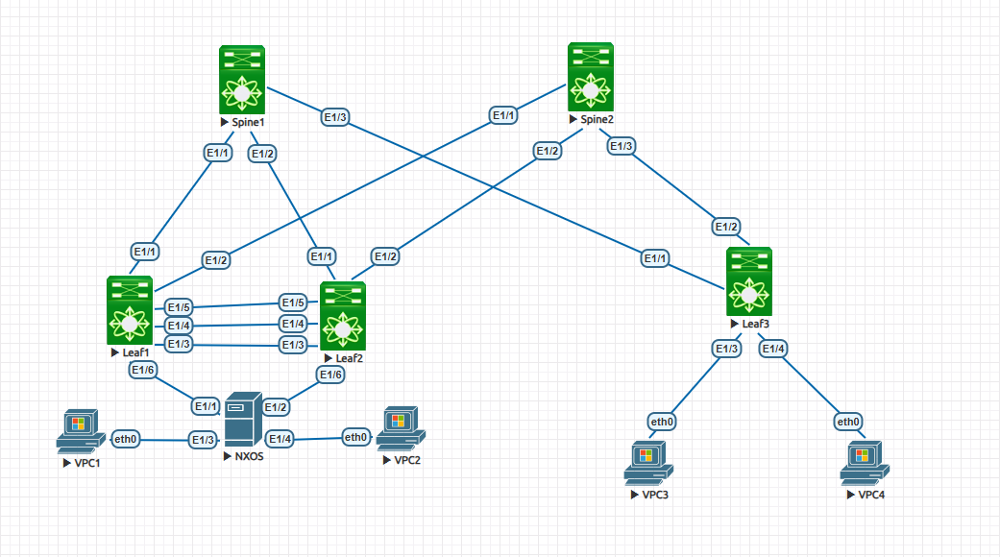

                                                              Курс "Дизайн сетей ЦОД" - OTUS.ru

                                                 Домашнее задание. 
*Цель:* **Настроить отказоустойчивое подключение клиентов с использованием EVPN Multihoming.**

1. Подключить клиентов 2-я линками к различным Leaf.
2. Настроить агрегированный канал со стороны клиента.
3. Настроить multihoming для работы в Overlay сети.
4. Зафиксировать в документации - план работы, адресное пространство, схему сети, конфигурацию устройств.
5. Протестировать отказоустойчивость - убедиться, что связнность не теряется при отключении одного из линков.

**1. Схема сети.**

**2. Адресное пространство.** 

|      Spine1           |     Spine2             |         Leaf1          |       Leaf2            |     Leaf3              |
|-----------------------|------------------------|------------------------|------------------------|------------------------|
| Eth1/1 10.10.1.1/30   | Eth1/1 10.10.2.1/30    | Eth1/1 10.10.1.2/30    | Eth1/1 10.10.1.6/30    | Eth1/1 10.10.1.9/30    |
| Eth1/2 10.10.1.5/30   | Eth1/2 10.10.2.5/30    | Eth1/2 10.10.2.2/30    | Eth1/2 10.10.2.6/30    | Eth1/2 10.10.2.9/30    |
| Eth1/3 10.10.1.9/30   | Eth1/3 10.10.2.9/30    | Eth1/3 trunk           | Eth1/3 trunk           | Eth1/3 access 11       |
|                       |                        |                        |                        | Eth1/4 access 13       |  
| Lo0 10.10.10.10/32    | Lo0 10.10.10.20/32     | Lo0 10.10.10.1/32      | Lo0 10.10.10.2/32      | Lo0 10.10.10.3/32      |
|                       |                        | Lo105 10.10.105.1/32   | Lo105 10.10.105.2/32   | Lo105 10.10.105.3/32   | 

                                                     Адресация VPC             

|         VLAN          |      VPC1              |         VPC2           |          VPC3          |         VPC4           |
|-----------------------|------------------------|------------------------|------------------------|------------------------|
|   VLAN **11** (GW .1) |  e0 192.168.11.10/28   |                        |   e0 192.168.11.5/28   |                        |  
|   VLAN **12** (GW .1) |                        |  e0 192.168.12.10/28   |                        |                        | 
|   VLAN **13** (GW .1) |                        |                        |                        |   e0 192.168.13.10/28  | 

                                               Автономные системы BGP (ASN)

|      Spine1           |     Spine2            |         Leaf1         |       Leaf2           |     Leaf3             |
|-----------------------|-----------------------|-----------------------|-----------------------|-----------------------|
| ASN 65010             | ASN 65010             | ASN 65001             | ASN 65002             | ASN 65003             |

**3. Конфигурация оборудования (конфигурация SPINE не менялась).**

Spine1 - [Здесь](Configs/Spine1.txt)

Spine2 - [Здесь](Configs/Spine2.txt)

Leaf1 -  [Здесь](Configs/Leaf1.txt)

Leaf2 -  [Здесь](Configs/Leaf2.txt)

Leaf3 -  [Здесь](Configs/Leaf3.txt)

 **4. Проверка кооректности настроек**

   ***LEAF 3***  

        Leaf3# sho ip route
        IP Route Table for VRF "default"
        '*' denotes best ucast next-hop
        '**' denotes best mcast next-hop
        '[x/y]' denotes [preference/metric]
        '%<string>' in via output denotes VRF <string>

        10.10.1.8/30, ubest/mbest: 1/0, attached
            *via 10.10.1.10, Eth1/1, [0/0], 21:07:47, direct
        10.10.1.10/32, ubest/mbest: 1/0, attached
            *via 10.10.1.10, Eth1/1, [0/0], 21:07:47, local
        10.10.2.8/30, ubest/mbest: 1/0, attached
            *via 10.10.2.10, Eth1/2, [0/0], 21:07:47, direct
        10.10.2.10/32, ubest/mbest: 1/0, attached
            *via 10.10.2.10, Eth1/2, [0/0], 21:07:47, local
        10.10.10.1/32, ubest/mbest: 2/0
            *via 10.10.1.9, [20/0], 20:27:38, bgp-65003, external, tag 65010
            *via 10.10.2.9, [20/0], 20:27:40, bgp-65003, external, tag 65010
        10.10.10.2/32, ubest/mbest: 2/0
            *via 10.10.1.9, [20/0], 20:27:33, bgp-65003, external, tag 65010
            *via 10.10.2.9, [20/0], 20:27:34, bgp-65003, external, tag 65010
        10.10.10.3/32, ubest/mbest: 2/0, attached
            *via 10.10.10.3, Lo0, [0/0], 21:08:28, local
            *via 10.10.10.3, Lo0, [0/0], 21:08:28, direct
        10.10.10.10/32, ubest/mbest: 1/0
            *via 10.10.1.9, [20/0], 21:07:38, bgp-65003, external, tag 65010
        10.10.10.20/32, ubest/mbest: 1/0
            *via 10.10.2.9, [20/0], 21:06:10, bgp-65003, external, tag 65010
        10.10.105.1/32, ubest/mbest: 2/0
            *via 10.10.1.9, [20/0], 18:54:11, bgp-65003, external, tag 65010
            *via 10.10.2.9, [20/0], 18:54:11, bgp-65003, external, tag 65010
        10.10.105.2/32, ubest/mbest: 2/0
            *via 10.10.1.9, [20/0], 15:34:09, bgp-65003, external, tag 65010
            *via 10.10.2.9, [20/0], 15:34:09, bgp-65003, external, tag 65010
        10.10.105.3/32, ubest/mbest: 2/0, attached
            *via 10.10.105.3, Lo105, [0/0], 15:44:38, local
            *via 10.10.105.3, Lo105, [0/0], 15:44:38, direct
        10.10.200.1/32, ubest/mbest: 2/0
            *via 10.10.1.9, [20/0], 14:53:00, bgp-65003, external, tag 65010
            *via 10.10.2.9, [20/0], 14:53:00, bgp-65003, external, tag 65010
        10.10.200.3/32, ubest/mbest: 2/0, attached
            *via 10.10.200.3, Lo105, [0/0], 15:37:38, local
            *via 10.10.200.3, Lo105, [0/0], 15:37:38, direct
.  

        Leaf3# sho ip route vrf VRF_MAIN
        IP Route Table for VRF "VRF_MAIN"
        '*' denotes best ucast next-hop
        '**' denotes best mcast next-hop
        '[x/y]' denotes [preference/metric]
        '%<string>' in via output denotes VRF <string>

        192.168.11.0/28, ubest/mbest: 1/0, attached
            *via 192.168.11.1, Vlan11, [0/0], 21:07:21, direct
        192.168.11.1/32, ubest/mbest: 1/0, attached
            *via 192.168.11.1, Vlan11, [0/0], 21:07:21, local
        192.168.11.5/32, ubest/mbest: 1/0, attached
            *via 192.168.11.5, Vlan11, [190/0], 15:32:50, hmm
        192.168.11.10/32, ubest/mbest: 1/0
            *via 10.10.200.1%default, [20/0], 14:51:51, bgp-65003, external, tag 65010 (
        evpn) segid: 9999 tunnelid: 0xa0ac801 encap: VXLAN

        192.168.12.10/32, ubest/mbest: 1/0
            *via 10.10.200.1%default, [20/0], 01:50:06, bgp-65003, external, tag 65010 (
        evpn) segid: 9999 tunnelid: 0xa0ac801 encap: VXLAN

        192.168.13.0/28, ubest/mbest: 1/0, attached
            *via 192.168.13.1, Vlan13, [0/0], 21:07:20, direct
        192.168.13.1/32, ubest/mbest: 1/0, attached
            *via 192.168.13.1, Vlan13, [0/0], 21:07:20, local
        192.168.13.10/32, ubest/mbest: 1/0, attached
            *via 192.168.13.10, Vlan13, [190/0], 01:48:09, hmm
.  

        Leaf3# sho bgp l2vpn evpn
        BGP routing table information for VRF default, address family L2VPN EVPN
        BGP table version is 2373, Local Router ID is 10.10.10.3
        Status: s-suppressed, x-deleted, S-stale, d-dampened, h-history, *-valid, >-best
        Path type: i-internal, e-external, c-confed, l-local, a-aggregate, r-redist, I-i
        njected
        Origin codes: i - IGP, e - EGP, ? - incomplete, | - multipath, & - backup

        Network            Next Hop            Metric     LocPrf     Weight Path
        Route Distinguisher: 10.10.10.1:32778
        *>e[2]:[0]:[0]:[48]:[0050.7966.6806]:[0]:[0.0.0.0]/216
                            10.10.200.1                                    0 65010 650
        01 i
        * e                   10.10.200.1                                    0 65010 650
        01 i
        * e[2]:[0]:[0]:[48]:[0050.7966.6806]:[32]:[192.168.11.10]/272
                            10.10.200.1                                    0 65010 650
        01 i
        *>e                   10.10.200.1                                    0 65010 650
        01 i
        * e[3]:[0]:[32]:[10.10.200.1]/88
                            10.10.200.1                                    0 65010 650
        01 i
        *>e                   10.10.200.1                                    0 65010 650
        01 i

        Route Distinguisher: 10.10.10.1:32779
        * e[2]:[0]:[0]:[48]:[0050.7966.6807]:[0]:[0.0.0.0]/216
                            10.10.200.1                                    0 65010 650
        01 i
        *>e                   10.10.200.1                                    0 65010 650
        01 i
        * e[2]:[0]:[0]:[48]:[0050.7966.6807]:[32]:[192.168.12.10]/272
                            10.10.200.1                                    0 65010 650
        01 i
        *>e                   10.10.200.1                                    0 65010 650
        01 i
        * e[3]:[0]:[32]:[10.10.200.1]/88
                            10.10.200.1                                    0 65010 650
        01 i
        *>e                   10.10.200.1                                    0 65010 650
        01 i

        Route Distinguisher: 10.10.10.2:32778
        *>e[2]:[0]:[0]:[48]:[0050.7966.6806]:[0]:[0.0.0.0]/216
                            10.10.200.1                                    0 65010 650
        02 i
        * e                   10.10.200.1                                    0 65010 650
        02 i
        * e[2]:[0]:[0]:[48]:[0050.7966.6806]:[32]:[192.168.11.10]/272
                            10.10.200.1                                    0 65010 650
        02 i
        *>e                   10.10.200.1                                    0 65010 650
        02 i
        * e[3]:[0]:[32]:[10.10.200.1]/88
                            10.10.200.1                                    0 65010 650
        02 i
        *>e                   10.10.200.1                                    0 65010 650
        02 i

        Route Distinguisher: 10.10.10.2:32779
        *>e[2]:[0]:[0]:[48]:[0050.7966.6807]:[0]:[0.0.0.0]/216
                            10.10.200.1                                    0 65010 650
        02 i
        * e                   10.10.200.1                                    0 65010 650
        02 i
        * e[2]:[0]:[0]:[48]:[0050.7966.6807]:[32]:[192.168.12.10]/272
                            10.10.200.1                                    0 65010 650
        02 i
        *>e                   10.10.200.1                                    0 65010 650
        02 i
        * e[3]:[0]:[32]:[10.10.200.1]/88
                            10.10.200.1                                    0 65010 650
        02 i
        *>e                   10.10.200.1                                    0 65010 650
        02 i

        Route Distinguisher: 10.10.10.3:32778    (L2VNI 10011)
        * e[2]:[0]:[0]:[48]:[0050.7966.6806]:[0]:[0.0.0.0]/216
                            10.10.200.1                                    0 65010 650
        02 i
        *>e                   10.10.200.1                                    0 65010 650
        01 i
        *>l[2]:[0]:[0]:[48]:[0050.7966.6808]:[0]:[0.0.0.0]/216
                            10.10.200.3                       100      32768 i
        *>e[2]:[0]:[0]:[48]:[0050.7966.6806]:[32]:[192.168.11.10]/272
                            10.10.200.1                                    0 65010 650
        01 i
        * e                   10.10.200.1                                    0 65010 650
        02 i
        *>l[2]:[0]:[0]:[48]:[0050.7966.6808]:[32]:[192.168.11.5]/272
                            10.10.200.3                       100      32768 i
        *>e[3]:[0]:[32]:[10.10.200.1]/88
                            10.10.200.1                                    0 65010 650
        02 i
        * e                   10.10.200.1                                    0 65010 650
        01 i
        *>l[3]:[0]:[32]:[10.10.200.3]/88
                            10.10.200.3                       100      32768 i

        Route Distinguisher: 10.10.10.3:32779    (L2VNI 10012)
        *>e[2]:[0]:[0]:[48]:[0050.7966.6807]:[0]:[0.0.0.0]/216
                            10.10.200.1                                    0 65010 650
        02 i
        * e                   10.10.200.1                                    0 65010 650
        01 i
        * e[2]:[0]:[0]:[48]:[0050.7966.6807]:[32]:[192.168.12.10]/272
                            10.10.200.1                                    0 65010 650
        02 i
        *>e                   10.10.200.1                                    0 65010 650
        01 i
        *>e[3]:[0]:[32]:[10.10.200.1]/88
                            10.10.200.1                                    0 65010 650
        02 i
        * e                   10.10.200.1                                    0 65010 650
        01 i
        *>l[3]:[0]:[32]:[10.10.200.3]/88
                            10.10.200.3                       100      32768 i

        Route Distinguisher: 10.10.10.3:32780    (L2VNI 10013)
        x l[2]:[0]:[0]:[48]:[0050.7966.6809]:[0]:[0.0.0.0]/216
                            10.10.200.3                       100      32768 i
        *>l[2]:[0]:[0]:[48]:[0050.7966.6809]:[32]:[192.168.13.10]/272
                            10.10.200.3                       100      32768 i
        *>l[3]:[0]:[32]:[10.10.200.3]/88
                            10.10.200.3                       100      32768 i

        Route Distinguisher: 10.10.10.3:3    (L3VNI 9999)
        *>e[2]:[0]:[0]:[48]:[0050.7966.6806]:[32]:[192.168.11.10]/272
                            10.10.200.1                                    0 65010 650
        01 i
        * e                   10.10.200.1                                    0 65010 650
        02 i
        * e[2]:[0]:[0]:[48]:[0050.7966.6807]:[32]:[192.168.12.10]/272
                            10.10.200.1                                    0 65010 650
        02 i
        *>e                   10.10.200.1                                    0 65010 650
        01 i

.  

        Leaf3# sho nve peers
        Interface Peer-IP          State LearnType Uptime   Router-Mac
        --------- ---------------  ----- --------- -------- -----------------
        nve1      10.10.200.1      Up    CP        14:54:58 5000.0004.0007

   ***LEAF 1***

        Leaf1# sho ip route vrf VRF_MAIN
        IP Route Table for VRF "VRF_MAIN"
        '*' denotes best ucast next-hop
        '**' denotes best mcast next-hop
        '[x/y]' denotes [preference/metric]
        '%<string>' in via output denotes VRF <string>

        192.168.11.0/28, ubest/mbest: 1/0, attached
            *via 192.168.11.1, Vlan11, [0/0], 21:01:59, direct
        192.168.11.1/32, ubest/mbest: 1/0, attached
            *via 192.168.11.1, Vlan11, [0/0], 21:01:59, local
        192.168.11.5/32, ubest/mbest: 1/0
            *via 10.10.200.3%default, [20/0], 14:55:34, bgp-65001, external, tag 65010 (
        evpn) segid: 9999 tunnelid: 0xa0ac803 encap: VXLAN

        192.168.11.10/32, ubest/mbest: 1/0, attached
            *via 192.168.11.10, Vlan11, [190/0], 15:37:19, hmm
        192.168.12.0/28, ubest/mbest: 1/0, attached
            *via 192.168.12.1, Vlan12, [0/0], 19:49:18, direct
        192.168.12.1/32, ubest/mbest: 1/0, attached
            *via 192.168.12.1, Vlan12, [0/0], 19:49:18, local
        192.168.12.10/32, ubest/mbest: 1/0, attached
            *via 192.168.12.10, Vlan12, [190/0], 01:54:13, hmm
        192.168.13.10/32, ubest/mbest: 1/0
            *via 10.10.200.3%default, [20/0], 01:52:16, bgp-65001, external, tag 65010 (
        evpn) segid: 9999 tunnelid: 0xa0ac803 encap: VXLAN
.  

        Leaf1# sho nve  peers
        Interface Peer-IP          State LearnType Uptime   Router-Mac
        --------- ---------------  ----- --------- -------- -----------------
        nve1      10.10.200.3      Up    CP        14:56:07 5000.0005.0007
.  

        Leaf1# sho mac address-table
        Legend:
                * - primary entry, G - Gateway MAC, (R) - Routed MAC, O - Overlay MAC
                age - seconds since last seen,+ - primary entry using vPC Peer-Link,
                (T) - True, (F) - False, C - ControlPlane MAC, ~ - vsan
        VLAN     MAC Address      Type      age     Secure NTFY Ports
        ---------+-----------------+--------+---------+------+----+------------------
        *   99     5000.0003.0007   static   -         F      F    Vlan99
        G    -     0005.0005.0005   static   -         F      F    sup-eth1(R)
        G    -     5000.0003.0007   static   -         F      F    sup-eth1(R)
        G   11     5000.0003.0007   static   -         F      F    sup-eth1(R)
        G   12     5000.0003.0007   static   -         F      F    sup-eth1(R)
        G   99     5000.0003.0007   static   -         F      F    sup-eth1(R)
        G   11     5000.0004.0007   static   -         F      F    vPC Peer-Link(R)
        G   12     5000.0004.0007   static   -         F      F    vPC Peer-Link(R)
        G   99     5000.0004.0007   static   -         F      F    vPC Peer-Link(R)
.  

        Leaf1# sho vpc
        Legend:
                        (*) - local vPC is down, forwarding via vPC peer-link

        vPC domain id                     : 1
        Peer status                       : peer adjacency formed ok
        vPC keep-alive status             : peer is alive
        Configuration consistency status  : success
        Per-vlan consistency status       : success
        Type-2 consistency status         : success
        vPC role                          : primary
        Number of vPCs configured         : 1
        Peer Gateway                      : Enabled
        Dual-active excluded VLANs        : -
        Graceful Consistency Check        : Enabled
        Auto-recovery status              : Disabled
        Delay-restore status              : Timer is off.(timeout = 30s)
        Delay-restore SVI status          : Timer is off.(timeout = 10s)
        Operational Layer3 Peer-router    : Enabled

        vPC Peer-link status
        ---------------------------------------------------------------------
        id    Port   Status Active vlans
        --    ----   ------ -------------------------------------------------
        1     Po100  up     1,11-12,99

        vPC status
        ----------------------------------------------------------------------------
        Id    Port          Status Consistency Reason                Active vlans
        --    ------------  ------ ----------- ------                ---------------
        150   Po150         up     success     success               11-12

        Please check "show vpc consistency-parameters vpc <vpc-num>" for the
        consistency reason of down vpc and for type-2 consistency reasons for
        any vpc.
.  

        Leaf1# sho vpc consistency-parameters global

            Legend:
                Type 1 : vPC will be suspended in case of mismatch

        Name                        Type  Local Value            Peer Value
        -------------               ----  ---------------------- -----------------------
        STP MST Simulate PVST       1     Enabled                Enabled
        STP Port Type, Edge         1     Normal, Disabled,      Normal, Disabled,
        BPDUFilter, Edge BPDUGuard        Disabled               Disabled
        STP MST Region Name         1     ""                     ""
        STP Disabled                1     None                   None
        STP Mode                    1     Rapid-PVST             Rapid-PVST
        STP Bridge Assurance        1     Enabled                Enabled
        STP Loopguard               1     Disabled               Disabled
        STP MST Region Instance to  1
        VLAN Mapping
        STP MST Region Revision     1     0                      0
        Interface-vlan admin up     2     11-12,99               11-12,99
        Interface-vlan routing      2     1,11-12,99             1,11-12,99
        capability
        Nve1 Admin State, Src       1     Up, Up, 10.10.200.1,   Up, Up, 10.10.200.1,
        Admin State, Secondary IP,        CP, FALSE              CP, FALSE
        Host Reach Mode, VMAC
        Advertisement
        Nve1 Vni, Mcast, Mode,      1     10011, 0.0.0.0,        10011, 0.0.0.0,
        Type, Flags                       UcastBGP, L2, None     UcastBGP, L2, None
        Nve1 Vni, Mcast, Mode,      1     10012, 0.0.0.0,        10012, 0.0.0.0,
        Type, Flags                       UcastBGP, L2, None     UcastBGP, L2, None
        Nve1 Vni, Mcast, Mode,      1     9999, 0.0.0.0, n/a,    9999, 0.0.0.0, n/a,
        Type, Flags                       L3, None               L3, None
        QoS (Cos)                   2     ([0-7], [], [], [],    ([0-7], [], [], [],
                                        [], [])                [], [])
        Network QoS (MTU)           2     (1500, 1500, 1500,     (1500, 1500, 1500,
                                        1500, 0, 0)            1500, 0, 0)
        Network Qos (Pause:         2     (F, F, F, F, F, F)     (F, F, F, F, F, F)
        T->Enabled, F->Disabled)
        Input Queuing (Bandwidth)   2     (0, 0, 0, 0, 0, 0)     (0, 0, 0, 0, 0, 0)
        Input Queuing (Absolute     2     (F, F, F, F, F, F)     (F, F, F, F, F, F)
        Priority: T->Enabled,
        F->Disabled)
        Output Queuing (Bandwidth   2     (100, 0, 0, 0, 0, 0)   (100, 0, 0, 0, 0, 0)
        Remaining)
        Output Queuing (Absolute    2     (F, F, F, T, F, F)     (F, F, F, T, F, F)
        Priority: T->Enabled,
        F->Disabled)
        Allowed VLANs               -     1,11-12,99             1,11-12,99
        Local suspended VLANs       -     -                      -
