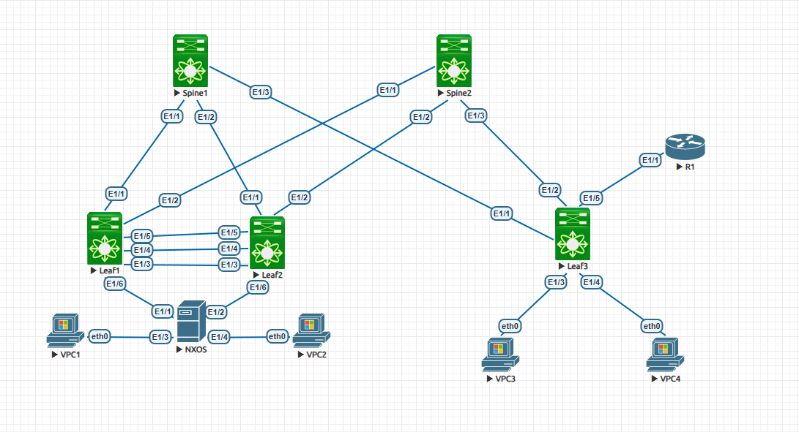

                                                              Курс "Дизайн сетей ЦОД" - OTUS.ru

                                                 Домашнее задание. 
*Цель:* **Реализовать передачу суммарных префиксов через EVPN route-type 5**

1. Разместить двух "клиентов" в разных VRF в рамках одной фабрики.
2. Настроить маршрутизацию между клиентами через внешнее устройство (граничный роутер\фаерволл\etc).
3. Зафиксировать в документации - план работы, адресное пространство, схему сети, настройки сетевого оборудования.

**1. Схема сети.**

**2. Адресное пространство.** 

|      Spine1           |     Spine2             |         Leaf1          |       Leaf2            |     Leaf3              |
|-----------------------|------------------------|------------------------|------------------------|------------------------|
| Eth1/1 10.10.1.1/30   | Eth1/1 10.10.2.1/30    | Eth1/1 10.10.1.2/30    | Eth1/1 10.10.1.6/30    | Eth1/1 10.10.1.9/30    |
| Eth1/2 10.10.1.5/30   | Eth1/2 10.10.2.5/30    | Eth1/2 10.10.2.2/30    | Eth1/2 10.10.2.6/30    | Eth1/2 10.10.2.9/30    |
| Eth1/3 10.10.1.9/30   | Eth1/3 10.10.2.9/30    | Eth1/3 trunk           | Eth1/3 trunk           | Eth1/3 access 11       |
|                       |                        |                        |                        | Eth1/4 access 13       |  
| Lo0 10.10.10.10/32    | Lo0 10.10.10.20/32     | Lo0 10.10.10.1/32      | Lo0 10.10.10.2/32      | Lo0 10.10.10.3/32      |
|                       |                        | Lo105 10.10.105.1/32   | Lo105 10.10.105.2/32   | Lo105 10.10.105.3/32   | 

                                                     Адресация VPC             

|         VLAN          | VPC1 - VRF INSIDE_AA   |  VPC2 - VRF VRF_Main   | VPC3 - VRF INSIDE_AA   | VPC4 - VRF VRF_Main    |
|-----------------------|------------------------|------------------------|------------------------|------------------------|
|   VLAN **11** (GW .1) |  e0 192.168.11.10/28   |                        |   e0 192.168.11.5/28   |                        |  
|   VLAN **12** (GW .1) |                        |  e0 192.168.12.10/28   |                        |  e0 192.168.12.5/28   | 

                                               Автономные системы BGP (ASN)

|      Spine1      |     Spine2       |       Leaf1      |     Leaf2        |     Leaf3        |     R1           |
|------------------|------------------|------------------|------------------|------------------|------------------|
| ASN 65010        | ASN 65010        | ASN 65001        | ASN 65002        | ASN 65003        | ASN 65000        |

**3. Конфигурация оборудования (конфигурация SPINE не менялась).**

R1 - [Здесь](Configs/R1.txt)

Spine1 -  [Здесь](Configs/Spine1.txt)

Spine2 -  [Здесь](Configs/Spine2.txt)

Leaf1 -  [Здесь](Configs/Leaf1.txt)

Leaf2 -  [Здесь](Configs/Leaf2.txt)

Leaf3 -  [Здесь](Configs/Leaf3.txt)

**4. Проверка кооректности настроек**

   ***R1***  
        
            R1# sho ip route
                IP Route Table for VRF "default"
                '*' denotes best ucast next-hop
                '**' denotes best mcast next-hop
                '[x/y]' denotes [preference/metric]
                '%<string>' in via output denotes VRF <string>

                0.0.0.0/0, ubest/mbest: 1/0
                    *via Null0, [1/0], 1d02h, static
                10.0.177.0/29, ubest/mbest: 1/0, attached
                    *via 10.0.177.6, Vlan177, [0/0], 01:28:50, direct
                10.0.177.6/32, ubest/mbest: 1/0, attached
                    *via 10.0.177.6, Vlan177, [0/0], 01:28:50, local
                10.0.199.0/29, ubest/mbest: 1/0, attached
                    *via 10.0.199.6, Vlan199, [0/0], 01:28:35, direct
                10.0.199.6/32, ubest/mbest: 1/0, attached
                    *via 10.0.199.6, Vlan199, [0/0], 01:28:35, local
                10.7.7.7/32, ubest/mbest: 2/0, attached
                    *via 10.7.7.7, Lo0, [0/0], 1d02h, local
                    *via 10.7.7.7, Lo0, [0/0], 1d02h, direct
                192.168.11.0/28, ubest/mbest: 1/0
                    *via 10.0.177.3, [20/0], 01:23:59, bgp-65000, external, tag 65003
                192.168.11.5/32, ubest/mbest: 1/0
                    *via 10.0.177.3, [1/0], 01:25:44, static
                192.168.11.10/32, ubest/mbest: 1/0
                    *via 10.0.177.3, [20/0], 01:23:59, bgp-65000, external, tag 65003
                192.168.12.0/28, ubest/mbest: 1/0
                    *via 10.0.199.3, [20/0], 01:23:50, bgp-65000, external, tag 65003
                192.168.12.5/32, ubest/mbest: 1/0
                    *via 10.0.199.3, [1/0], 01:25:54, static
                192.168.12.10/32, ubest/mbest: 1/0
                    *via 10.0.199.3, [20/0], 01:23:50, bgp-65000, external, tag 65003

            R1# sho ip bgp
                BGP routing table information for VRF default, address family IPv4 Unicast
                BGP table version is 81, Local Router ID is 10.7.7.7
                Status: s-suppressed, x-deleted, S-stale, d-dampened, h-history, *-valid, >-best
                Path type: i-internal, e-external, c-confed, l-local, a-aggregate, r-redist, I-i
                njected
                Origin codes: i - IGP, e - EGP, ? - incomplete, | - multipath, & - backup

                Network            Next Hop            Metric     LocPrf     Weight Path
                *>e10.0.177.0/29      10.0.177.3               0                     0 65003 ?
                *>e10.0.199.0/29      10.0.199.3               0                     0 65003 ?
                *>l10.7.7.7/32        0.0.0.0                           100      32768 i
                *>e192.168.11.0/28    10.0.177.3               0                     0 65003 ?
                *>e192.168.11.10/32   10.0.177.3                                     0 65003 650
                10 65002 i
                *>e192.168.12.0/28    10.0.199.3               0                     0 65003 ?
                *>e192.168.12.10/32   10.0.199.3                                     0 65003 650
                10 65001 i

   ***LEAF1***  

    Leaf1# sho ip route vrf INSIDE_AA
        IP Route Table for VRF "INSIDE_AA"
        '*' denotes best ucast next-hop
        '**' denotes best mcast next-hop
        '[x/y]' denotes [preference/metric]
        '%<string>' in via output denotes VRF <string>

        0.0.0.0/0, ubest/mbest: 1/0
            *via 10.10.200.3%default, [20/0], 2d22h, bgp-65001, external, tag 65010 (evp
        n) segid: 7777 tunnelid: 0xa0ac803 encap: VXLAN

        10.0.177.0/29, ubest/mbest: 1/0
            *via 10.10.200.3%default, [20/0], 3d03h, bgp-65001, external, tag 65010 (evp
        n) segid: 7777 tunnelid: 0xa0ac803 encap: VXLAN

        10.7.7.7/32, ubest/mbest: 1/0
            *via 10.10.200.3%default, [20/0], 2d22h, bgp-65001, external, tag 65010 (evp
        n) segid: 7777 tunnelid: 0xa0ac803 encap: VXLAN

        192.168.11.0/28, ubest/mbest: 1/0, attached
            *via 192.168.11.1, Vlan11, [0/0], 5d22h, direct
        192.168.11.1/32, ubest/mbest: 1/0, attached
            *via 192.168.11.1, Vlan11, [0/0], 5d22h, local
        192.168.11.5/32, ubest/mbest: 1/0
            *via 10.10.200.3%default, [20/0], 3d03h, bgp-65001, external, tag 65010 (evp
        n) segid: 7777 tunnelid: 0xa0ac803 encap: VXLAN

        192.168.11.10/32, ubest/mbest: 1/0, attached
            *via 192.168.11.10, Vlan11, [190/0], 5d22h, hmm

    Leaf1# sho ip route vrf VRF_MAIN
        IP Route Table for VRF "VRF_MAIN"
        '*' denotes best ucast next-hop
        '**' denotes best mcast next-hop
        '[x/y]' denotes [preference/metric]
        '%<string>' in via output denotes VRF <string>

        0.0.0.0/0, ubest/mbest: 1/0
            *via 10.10.200.3%default, [20/0], 2d22h, bgp-65001, external, tag 65010 (evp
        n) segid: 9999 tunnelid: 0xa0ac803 encap: VXLAN

        10.0.199.0/29, ubest/mbest: 1/0
            *via 10.10.200.3%default, [20/0], 3d03h, bgp-65001, external, tag 65010 (evp
        n) segid: 9999 tunnelid: 0xa0ac803 encap: VXLAN

        10.7.7.7/32, ubest/mbest: 1/0
            *via 10.10.200.3%default, [20/0], 2d22h, bgp-65001, external, tag 65010 (evp
        n) segid: 9999 tunnelid: 0xa0ac803 encap: VXLAN

        192.168.12.0/28, ubest/mbest: 1/0, attached
            *via 192.168.12.1, Vlan12, [0/0], 1w4d, direct
        192.168.12.1/32, ubest/mbest: 1/0, attached
            *via 192.168.12.1, Vlan12, [0/0], 1w4d, local
        192.168.12.5/32, ubest/mbest: 1/0
            *via 10.10.200.3%default, [20/0], 3d03h, bgp-65001, external, tag 65010 (evp
        n) segid: 9999 tunnelid: 0xa0ac803 encap: VXLAN

        192.168.12.10/32, ubest/mbest: 1/0, attached
            *via 192.168.12.10, Vlan12, [190/0], 1w3d, hmm

    Leaf1# sho bgp l2vpn evpn
        BGP routing table information for VRF default, address family L2VPN EVPN
        BGP table version is 30962, Local Router ID is 10.10.10.1
        Status: s-suppressed, x-deleted, S-stale, d-dampened, h-history, *-valid, >-best
        Path type: i-internal, e-external, c-confed, l-local, a-aggregate, r-redist, I-i
        njected
        Origin codes: i - IGP, e - EGP, ? - incomplete, | - multipath, & - backup

        Network            Next Hop            Metric     LocPrf     Weight Path
        Route Distinguisher: 10.10.10.1:32778    (L2VNI 10011)
        *>l[2]:[0]:[0]:[48]:[0050.7966.6806]:[0]:[0.0.0.0]/216
                            10.10.200.1                       100      32768 i
        *>e[2]:[0]:[0]:[48]:[0050.7966.6808]:[0]:[0.0.0.0]/216
                            10.10.200.3                                    0 65010 650
        03 i
        *>l[2]:[0]:[0]:[48]:[0050.7966.6806]:[32]:[192.168.11.10]/272
                            10.10.200.1                       100      32768 i
        *>e[2]:[0]:[0]:[48]:[0050.7966.6808]:[32]:[192.168.11.5]/272
                            10.10.200.3                                    0 65010 650
        03 i
        *>l[3]:[0]:[32]:[10.10.200.1]/88
                            10.10.200.1                       100      32768 i
        *>e[3]:[0]:[32]:[10.10.200.3]/88
                            10.10.200.3                                    0 65010 650
        03 i

        Route Distinguisher: 10.10.10.1:32779    (L2VNI 10012)
        *>l[2]:[0]:[0]:[48]:[0050.7966.6807]:[0]:[0.0.0.0]/216
                            10.10.200.1                       100      32768 i
        *>e[2]:[0]:[0]:[48]:[0050.7966.6809]:[0]:[0.0.0.0]/216
                            10.10.200.3                                    0 65010 650
        03 i
        *>l[2]:[0]:[0]:[48]:[0050.7966.6807]:[32]:[192.168.12.10]/272
                            10.10.200.1                       100      32768 i
        *>e[2]:[0]:[0]:[48]:[0050.7966.6809]:[32]:[192.168.12.5]/272
                            10.10.200.3                                    0 65010 650
        03 i
        *>l[3]:[0]:[32]:[10.10.200.1]/88
                            10.10.200.1                       100      32768 i
        *>e[3]:[0]:[32]:[10.10.200.3]/88
                            10.10.200.3                                    0 65010 650
        03 i

        Route Distinguisher: 10.10.10.3:3
        * e[5]:[0]:[0]:[0]:[0.0.0.0]:[0.0.0.0]/224
                            10.10.200.3                                    0 65010 650
        03 65000 i
        *>e                   10.10.200.3                                    0 65010 650
        03 65000 i
        * e[5]:[0]:[0]:[28]:[192.168.11.0]:[0.0.0.0]/224
                            10.10.200.3                                    0 65010 650
        03 ?
        *>e                   10.10.200.3                                    0 65010 650
        03 ?
        * e[5]:[0]:[0]:[29]:[10.0.177.0]:[0.0.0.0]/224
                            10.10.200.3                                    0 65010 650
        03 ?
        *>e                   10.10.200.3                                    0 65010 650
        03 ?
        * e[5]:[0]:[0]:[32]:[10.7.7.7]:[0.0.0.0]/224
                            10.10.200.3                                    0 65010 650
        03 65000 i
        *>e                   10.10.200.3                                    0 65010 650
        03 65000 i

        Route Distinguisher: 10.10.10.3:4
        * e[5]:[0]:[0]:[0]:[0.0.0.0]:[0.0.0.0]/224
                            10.10.200.3                                    0 65010 650
        03 65000 i
        *>e                   10.10.200.3                                    0 65010 650
        03 65000 i
        * e[5]:[0]:[0]:[28]:[192.168.12.0]:[0.0.0.0]/224
                            10.10.200.3                                    0 65010 650
        03 ?
        *>e                   10.10.200.3                                    0 65010 650
        03 ?
        *>e[5]:[0]:[0]:[29]:[10.0.199.0]:[0.0.0.0]/224
                            10.10.200.3                                    0 65010 650
        03 ?
        * e                   10.10.200.3                                    0 65010 650
        03 ?
        * e[5]:[0]:[0]:[32]:[10.7.7.7]:[0.0.0.0]/224
                            10.10.200.3                                    0 65010 650
        03 65000 i
        *>e                   10.10.200.3                                    0 65010 650
        03 65000 i

        Route Distinguisher: 10.10.10.3:32778
        * e[2]:[0]:[0]:[48]:[0050.7966.6808]:[0]:[0.0.0.0]/216
                            10.10.200.3                                    0 65010 650
        03 i
        *>e                   10.10.200.3                                    0 65010 650
        03 i
        * e[2]:[0]:[0]:[48]:[0050.7966.6808]:[32]:[192.168.11.5]/272
                            10.10.200.3                                    0 65010 650
        03 i
        *>e                   10.10.200.3                                    0 65010 650
        03 i
        * e[3]:[0]:[32]:[10.10.200.3]/88
                            10.10.200.3                                    0 65010 650
        03 i
        *>e                   10.10.200.3                                    0 65010 650
        03 i

        Route Distinguisher: 10.10.10.3:32779
        * e[2]:[0]:[0]:[48]:[0050.7966.6809]:[0]:[0.0.0.0]/216
                            10.10.200.3                                    0 65010 650
        03 i
        *>e                   10.10.200.3                                    0 65010 650
        03 i
        * e[2]:[0]:[0]:[48]:[0050.7966.6809]:[32]:[192.168.12.5]/272
                            10.10.200.3                                    0 65010 650
        03 i
        *>e                   10.10.200.3                                    0 65010 650
        03 i
        * e[3]:[0]:[32]:[10.10.200.3]/88
                            10.10.200.3                                    0 65010 650
        03 i
        *>e                   10.10.200.3                                    0 65010 650
        03 i

        Route Distinguisher: 10.10.10.1:3    (L3VNI 9999)
        *>e[2]:[0]:[0]:[48]:[0050.7966.6809]:[32]:[192.168.12.5]/272
                            10.10.200.3                                    0 65010 650
        03 i
        *>e[5]:[0]:[0]:[0]:[0.0.0.0]:[0.0.0.0]/224
                            10.10.200.3                                    0 65010 650
        03 65000 i
        * e[5]:[0]:[0]:[28]:[192.168.12.0]:[0.0.0.0]/224
                            10.10.200.3                                    0 65010 650
        03 ?
        *>l                   10.10.200.1              0        100      32768 ?
        *>e[5]:[0]:[0]:[29]:[10.0.199.0]:[0.0.0.0]/224
                            10.10.200.3                                    0 65010 650
        03 ?
        *>e[5]:[0]:[0]:[32]:[10.7.7.7]:[0.0.0.0]/224
                            10.10.200.3                                    0 65010 650
        03 65000 i

        Route Distinguisher: 10.10.10.1:5    (L3VNI 7777)
        *>e[2]:[0]:[0]:[48]:[0050.7966.6808]:[32]:[192.168.11.5]/272
                            10.10.200.3                                    0 65010 650
        03 i
        *>e[5]:[0]:[0]:[0]:[0.0.0.0]:[0.0.0.0]/224
                            10.10.200.3                                    0 65010 650
        03 65000 i
        * e[5]:[0]:[0]:[28]:[192.168.11.0]:[0.0.0.0]/224
                            10.10.200.3                                    0 65010 650
        03 ?
        *>l                   10.10.200.1              0        100      32768 ?
        *>e[5]:[0]:[0]:[29]:[10.0.177.0]:[0.0.0.0]/224
                            10.10.200.3                                    0 65010 650
        03 ?
        *>e[5]:[0]:[0]:[32]:[10.7.7.7]:[0.0.0.0]/224
                            10.10.200.3                                    0 65010 650
        03 65000 i

    Leaf1# sho bgp l2vpn evpn | include 192.168.
        *>l[2]:[0]:[0]:[48]:[0050.7966.6806]:[32]:[192.168.11.10]/272
        *>e[2]:[0]:[0]:[48]:[0050.7966.6808]:[32]:[192.168.11.5]/272
        *>l[2]:[0]:[0]:[48]:[0050.7966.6807]:[32]:[192.168.12.10]/272
        *>e[2]:[0]:[0]:[48]:[0050.7966.6809]:[32]:[192.168.12.5]/272
        * e[5]:[0]:[0]:[28]:[192.168.11.0]:[0.0.0.0]/224
        * e[5]:[0]:[0]:[28]:[192.168.12.0]:[0.0.0.0]/224
        * e[2]:[0]:[0]:[48]:[0050.7966.6808]:[32]:[192.168.11.5]/272
        * e[2]:[0]:[0]:[48]:[0050.7966.6809]:[32]:[192.168.12.5]/272
        *>e[2]:[0]:[0]:[48]:[0050.7966.6809]:[32]:[192.168.12.5]/272
        * e[5]:[0]:[0]:[28]:[192.168.12.0]:[0.0.0.0]/224
        *>e[2]:[0]:[0]:[48]:[0050.7966.6808]:[32]:[192.168.11.5]/272
        * e[5]:[0]:[0]:[28]:[192.168.11.0]:[0.0.0.0]/224

   ***LEAF3***  

    Leaf3# sho ip route vrf INSIDE_AA
        IP Route Table for VRF "INSIDE_AA"
        '*' denotes best ucast next-hop
        '**' denotes best mcast next-hop
        '[x/y]' denotes [preference/metric]
        '%<string>' in via output denotes VRF <string>

        0.0.0.0/0, ubest/mbest: 1/0
            *via 10.0.177.6, [20/0], 2d22h, bgp-65003, external, tag 65000
        10.0.177.0/29, ubest/mbest: 1/0, attached
            *via 10.0.177.3, Vlan177, [0/0], 3d03h, direct
        10.0.177.3/32, ubest/mbest: 1/0, attached
            *via 10.0.177.3, Vlan177, [0/0], 3d03h, local
        10.7.7.7/32, ubest/mbest: 1/0
            *via 10.0.177.6, [20/0], 2d22h, bgp-65003, external, tag 65000
        192.168.11.0/28, ubest/mbest: 1/0, attached
            *via 192.168.11.1, Vlan11, [0/0], 4d21h, direct
        192.168.11.1/32, ubest/mbest: 1/0, attached
            *via 192.168.11.1, Vlan11, [0/0], 4d21h, local
        192.168.11.5/32, ubest/mbest: 1/0, attached
            *via 192.168.11.5, Vlan11, [190/0], 3d03h, hmm
        192.168.11.10/32, ubest/mbest: 1/0
            *via 10.10.200.1%default, [20/0], 4d21h, bgp-65003, external, tag 65010 (evp
        n) segid: 7777 tunnelid: 0xa0ac801 encap: VXLAN

        Leaf3# sho ip route vrf VRF_MAIN
        IP Route Table for VRF "VRF_MAIN"
        '*' denotes best ucast next-hop
        '**' denotes best mcast next-hop
        '[x/y]' denotes [preference/metric]
        '%<string>' in via output denotes VRF <string>

        0.0.0.0/0, ubest/mbest: 1/0
            *via 10.0.199.6, [20/0], 2d22h, bgp-65003, external, tag 65000
        10.0.199.0/29, ubest/mbest: 1/0, attached
            *via 10.0.199.3, Vlan199, [0/0], 3d03h, direct
        10.0.199.3/32, ubest/mbest: 1/0, attached
            *via 10.0.199.3, Vlan199, [0/0], 3d03h, local
        10.7.7.7/32, ubest/mbest: 1/0
            *via 10.0.199.6, [20/0], 2d22h, bgp-65003, external, tag 65000
        192.168.12.0/28, ubest/mbest: 1/0, attached
            *via 192.168.12.1, Vlan12, [0/0], 4d21h, direct
        192.168.12.1/32, ubest/mbest: 1/0, attached
            *via 192.168.12.1, Vlan12, [0/0], 4d21h, local
        192.168.12.5/32, ubest/mbest: 1/0, attached
            *via 192.168.12.5, Vlan12, [190/0], 3d03h, hmm
        192.168.12.10/32, ubest/mbest: 1/0
            *via 10.10.200.1%default, [20/0], 4d21h, bgp-65003, external, tag 65010 (evp
        n) segid: 9999 tunnelid: 0xa0ac801 encap: VXLAN

    Leaf3# show ip bgp
        BGP routing table information for VRF default, address family IPv4 Unicast
        BGP table version is 26, Local Router ID is 10.10.10.3
        Status: s-suppressed, x-deleted, S-stale, d-dampened, h-history, *-valid, >-best
        Path type: i-internal, e-external, c-confed, l-local, a-aggregate, r-redist, I-i
        njected
        Origin codes: i - IGP, e - EGP, ? - incomplete, | - multipath, & - backup

        Network            Next Hop            Metric     LocPrf     Weight Path
        *|e10.10.1.0/30       10.10.2.9                                      0 65010 650
        01 ?
        *>e                   10.10.1.9                                      0 65010 650
        01 ?
        *|e10.10.2.0/30       10.10.1.9                                      0 65010 650
        01 ?
        *>e                   10.10.2.9                                      0 65010 650
        01 ?
        *|e10.10.10.1/32      10.10.2.9                                      0 65010 650
        01 i
        *>e                   10.10.1.9                                      0 65010 650
        01 i
        *|e10.10.10.2/32      10.10.2.9                                      0 65010 650
        02 i
        *>e                   10.10.1.9                                      0 65010 650
        02 i
        *>l10.10.10.3/32      0.0.0.0                           100      32768 i
        *>e10.10.10.10/32     10.10.1.9                                      0 65010 i
        *>e10.10.10.20/32     10.10.2.9                                      0 65010 i
        *|e10.10.105.1/32     10.10.2.9                                      0 65010 650
        01 i
        *>e                   10.10.1.9                                      0 65010 650
        01 i
        *|e10.10.105.2/32     10.10.2.9                                      0 65010 650
        02 i
        *>e                   10.10.1.9                                      0 65010 650
        02 i
        *>l10.10.105.3/32     0.0.0.0                           100      32768 i
        *|e10.10.200.1/32     10.10.2.9                                      0 65010 650
        01 i
        *>e                   10.10.1.9                                      0 65010 650
        01 i
        *>l10.10.200.3/32     0.0.0.0                           100      32768 i

    Leaf3# sho bgp l2vpn evpn | include 192.168.
        * e[5]:[0]:[0]:[28]:[192.168.12.0]:[0.0.0.0]/224
        * e[5]:[0]:[0]:[28]:[192.168.11.0]:[0.0.0.0]/224
        * e[2]:[0]:[0]:[48]:[0050.7966.6806]:[32]:[192.168.11.10]/272
        * e[2]:[0]:[0]:[48]:[0050.7966.6807]:[32]:[192.168.12.10]/272
        * e[2]:[0]:[0]:[48]:[0050.7966.6806]:[32]:[192.168.11.10]/272
        * e[2]:[0]:[0]:[48]:[0050.7966.6807]:[32]:[192.168.12.10]/272
        *>e[2]:[0]:[0]:[48]:[0050.7966.6806]:[32]:[192.168.11.10]/272
        *>l[2]:[0]:[0]:[48]:[0050.7966.6808]:[32]:[192.168.11.5]/272
        *>e[2]:[0]:[0]:[48]:[0050.7966.6807]:[32]:[192.168.12.10]/272
        *>l[2]:[0]:[0]:[48]:[0050.7966.6809]:[32]:[192.168.12.5]/272
        *>e[2]:[0]:[0]:[48]:[0050.7966.6806]:[32]:[192.168.11.10]/272
        *>l[5]:[0]:[0]:[28]:[192.168.11.0]:[0.0.0.0]/224
        *>e[2]:[0]:[0]:[48]:[0050.7966.6807]:[32]:[192.168.12.10]/272
        *>l[5]:[0]:[0]:[28]:[192.168.12.0]:[0.0.0.0]/224

    Leaf3# sho bgp l2vpn evpn
        BGP routing table information for VRF default, address family L2VPN EVPN
        BGP table version is 32556, Local Router ID is 10.10.10.3
        Status: s-suppressed, x-deleted, S-stale, d-dampened, h-history, *-valid, >-best
        Path type: i-internal, e-external, c-confed, l-local, a-aggregate, r-redist, I-i
        njected
        Origin codes: i - IGP, e - EGP, ? - incomplete, | - multipath, & - backup

        Network            Next Hop            Metric     LocPrf     Weight Path
        Route Distinguisher: 10.10.10.1:3
        * e[5]:[0]:[0]:[28]:[192.168.12.0]:[0.0.0.0]/224
                            10.10.200.1                                    0 65010 650
        01 ?
        *>e                   10.10.200.1                                    0 65010 650
        01 ?

        Route Distinguisher: 10.10.10.1:5
        * e[5]:[0]:[0]:[28]:[192.168.11.0]:[0.0.0.0]/224
                            10.10.200.1                                    0 65010 650
        01 ?
        *>e                   10.10.200.1                                    0 65010 650
        01 ?

        Route Distinguisher: 10.10.10.1:32778
        * e[2]:[0]:[0]:[48]:[0050.7966.6806]:[0]:[0.0.0.0]/216
                            10.10.200.1                                    0 65010 650
        01 i
        *>e                   10.10.200.1                                    0 65010 650
        01 i
        * e[2]:[0]:[0]:[48]:[0050.7966.6806]:[32]:[192.168.11.10]/272
                            10.10.200.1                                    0 65010 650
        01 i
        *>e                   10.10.200.1                                    0 65010 650
        01 i
        * e[3]:[0]:[32]:[10.10.200.1]/88
                            10.10.200.1                                    0 65010 650
        01 i
        *>e                   10.10.200.1                                    0 65010 650
        01 i

        Route Distinguisher: 10.10.10.1:32779
        * e[2]:[0]:[0]:[48]:[0050.7966.6807]:[32]:[192.168.12.10]/272
                            10.10.200.1                                    0 65010 650
        01 i
        *>e                   10.10.200.1                                    0 65010 650
        01 i
        * e[3]:[0]:[32]:[10.10.200.1]/88
                            10.10.200.1                                    0 65010 650
        01 i
        *>e                   10.10.200.1                                    0 65010 650
        01 i

        Route Distinguisher: 10.10.10.2:32778
        *>e[2]:[0]:[0]:[48]:[0050.7966.6806]:[0]:[0.0.0.0]/216
                            10.10.200.1                                    0 65010 650
        02 i
        * e                   10.10.200.1                                    0 65010 650
        02 i
        * e[2]:[0]:[0]:[48]:[0050.7966.6806]:[32]:[192.168.11.10]/272
                            10.10.200.1                                    0 65010 650
        02 i
        *>e                   10.10.200.1                                    0 65010 650
        02 i
        * e[3]:[0]:[32]:[10.10.200.1]/88
                            10.10.200.1                                    0 65010 650
        02 i
        *>e                   10.10.200.1                                    0 65010 650
        02 i

        Route Distinguisher: 10.10.10.2:32779
        * e[2]:[0]:[0]:[48]:[0050.7966.6807]:[0]:[0.0.0.0]/216
                            10.10.200.1                                    0 65010 650
        02 i
        *>e                   10.10.200.1                                    0 65010 650
        02 i
        * e[2]:[0]:[0]:[48]:[0050.7966.6807]:[32]:[192.168.12.10]/272
                            10.10.200.1                                    0 65010 650
        02 i
        *>e                   10.10.200.1                                    0 65010 650
        02 i
        * e[3]:[0]:[32]:[10.10.200.1]/88
                            10.10.200.1                                    0 65010 650
        02 i
        *>e                   10.10.200.1                                    0 65010 650
        02 i

        Route Distinguisher: 10.10.10.3:32778    (L2VNI 10011)
        *>e[2]:[0]:[0]:[48]:[0050.7966.6806]:[0]:[0.0.0.0]/216
                            10.10.200.1                                    0 65010 650
        02 i
        * e                   10.10.200.1                                    0 65010 650
        01 i
        *>l[2]:[0]:[0]:[48]:[0050.7966.6808]:[0]:[0.0.0.0]/216
                            10.10.200.3                       100      32768 i
        *>e[2]:[0]:[0]:[48]:[0050.7966.6806]:[32]:[192.168.11.10]/272
                            10.10.200.1                                    0 65010 650
        02 i
        * e                   10.10.200.1                                    0 65010 650
        01 i
        *>l[2]:[0]:[0]:[48]:[0050.7966.6808]:[32]:[192.168.11.5]/272
                            10.10.200.3                       100      32768 i
        *>e[3]:[0]:[32]:[10.10.200.1]/88
                            10.10.200.1                                    0 65010 650
        02 i
        * e                   10.10.200.1                                    0 65010 650
        01 i
        *>l[3]:[0]:[32]:[10.10.200.3]/88
                            10.10.200.3                       100      32768 i

        Route Distinguisher: 10.10.10.3:32779    (L2VNI 10012)
        *>e[2]:[0]:[0]:[48]:[0050.7966.6807]:[0]:[0.0.0.0]/216
                            10.10.200.1                                    0 65010 650
        02 i
        *>l[2]:[0]:[0]:[48]:[0050.7966.6809]:[0]:[0.0.0.0]/216
                            10.10.200.3                       100      32768 i
        *>e[2]:[0]:[0]:[48]:[0050.7966.6807]:[32]:[192.168.12.10]/272
                            10.10.200.1                                    0 65010 650
        01 i
        * e                   10.10.200.1                                    0 65010 650
        02 i
        *>l[2]:[0]:[0]:[48]:[0050.7966.6809]:[32]:[192.168.12.5]/272
                            10.10.200.3                       100      32768 i
        *>e[3]:[0]:[32]:[10.10.200.1]/88
                            10.10.200.1                                    0 65010 650
        02 i
        * e                   10.10.200.1                                    0 65010 650
        01 i
        *>l[3]:[0]:[32]:[10.10.200.3]/88
                            10.10.200.3                       100      32768 i

        Route Distinguisher: 10.10.10.3:3    (L3VNI 7777)
        *>e[2]:[0]:[0]:[48]:[0050.7966.6806]:[32]:[192.168.11.10]/272
                            10.10.200.1                                    0 65010 650
        02 i
        * e                   10.10.200.1                                    0 65010 650
        01 i
        *>l[5]:[0]:[0]:[0]:[0.0.0.0]:[0.0.0.0]/224
                            10.10.200.3                                    0 65000 i
        *>l[5]:[0]:[0]:[28]:[192.168.11.0]:[0.0.0.0]/224
                            10.10.200.3              0        100      32768 ?
        * e                   10.10.200.1                                    0 65010 650
        01 ?
        *>l[5]:[0]:[0]:[29]:[10.0.177.0]:[0.0.0.0]/224
                            10.10.200.3              0        100      32768 ?
        *>l[5]:[0]:[0]:[32]:[10.7.7.7]:[0.0.0.0]/224
                            10.10.200.3                                    0 65000 i

        Route Distinguisher: 10.10.10.3:4    (L3VNI 9999)
        *>e[2]:[0]:[0]:[48]:[0050.7966.6807]:[32]:[192.168.12.10]/272
                            10.10.200.1                                    0 65010 650
        01 i
        * e                   10.10.200.1                                    0 65010 650
        02 i
        *>l[5]:[0]:[0]:[0]:[0.0.0.0]:[0.0.0.0]/224
                            10.10.200.3                                    0 65000 i
        *>l[5]:[0]:[0]:[28]:[192.168.12.0]:[0.0.0.0]/224
                            10.10.200.3              0        100      32768 ?
        * e                   10.10.200.1                                    0 65010 650
        01 ?
        *>l[5]:[0]:[0]:[29]:[10.0.199.0]:[0.0.0.0]/224
                            10.10.200.3              0        100      32768 ?
        *>l[5]:[0]:[0]:[32]:[10.7.7.7]:[0.0.0.0]/224
                            10.10.200.3                                    0 65000 i

   
   **5. Проверка доступности хостов**

VPC 1  
 