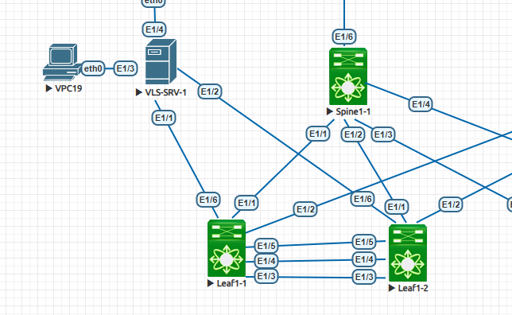
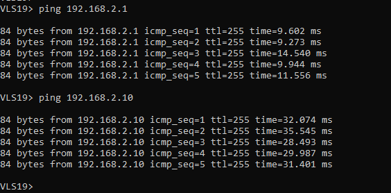
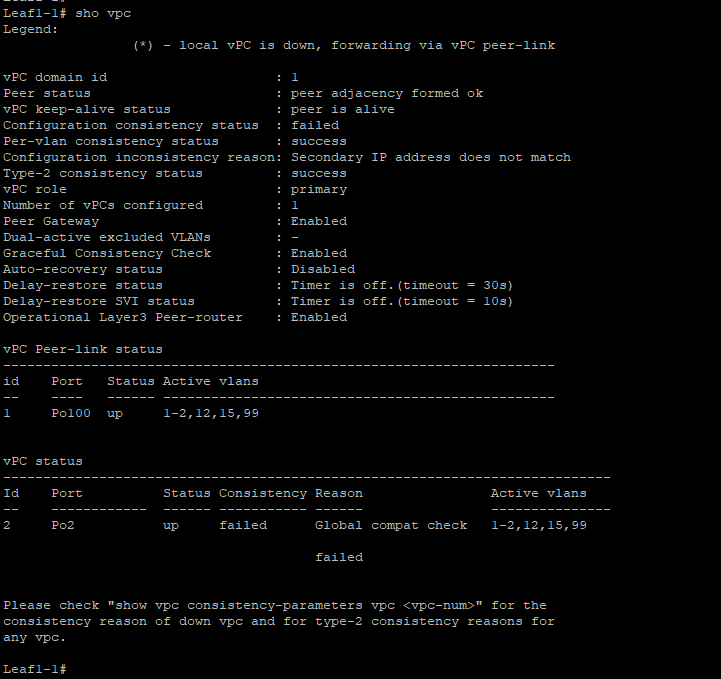
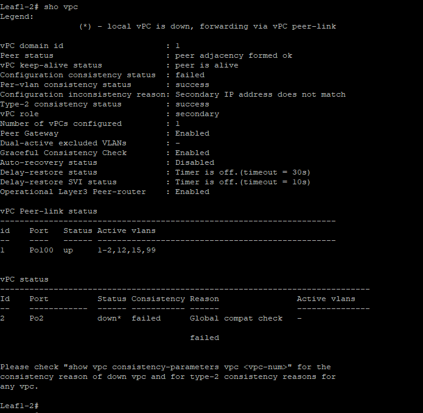

                                                              Курс "Дизайн сетей ЦОД" - OTUS.ru  

                                                              ПРОЕКТНАЯ РАБОТА  
                                             "Проектирование сетевой фабрики на основне VxLAN EVPN"  

**1. Фрагмент схемы сети.**

**2. Конфигурация оборудования.**

Leaf1-1 -  [Здесь](Configs/Leaf1-1.txt)

Leaf1-2 -  [Здесь](Configs/Leaf1-2.txt)

VLS-SRV-1 - [Здесь](Configs/VLS-SRV-1.txt)

**3. Вывод и ошибка vPC**  

Пинги до Gw и до другого VPC (L3VPN) проходят через Leaf1-1  
  

Ошибка vPC  
  

 